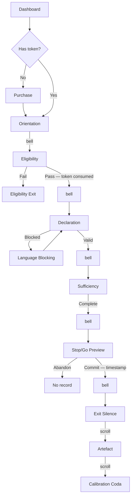
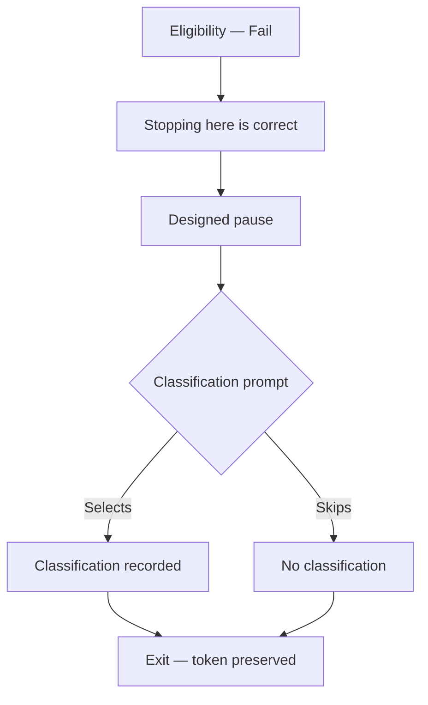
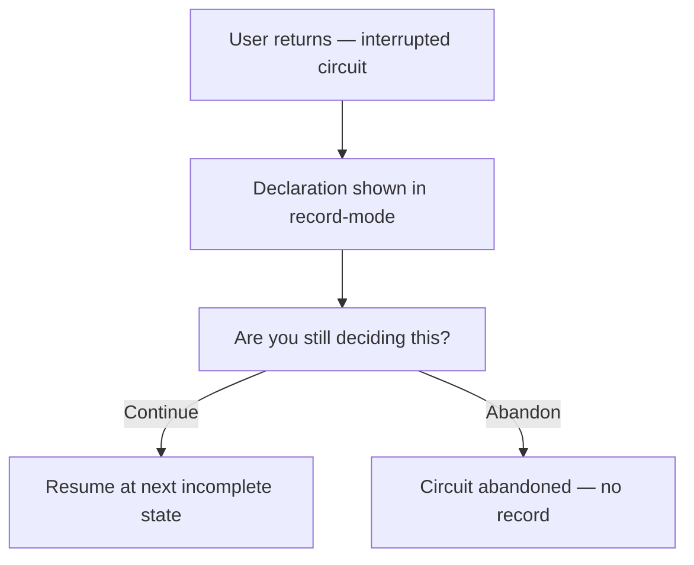
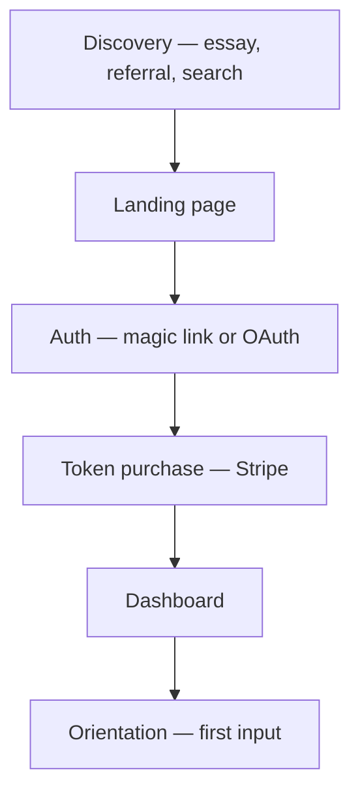
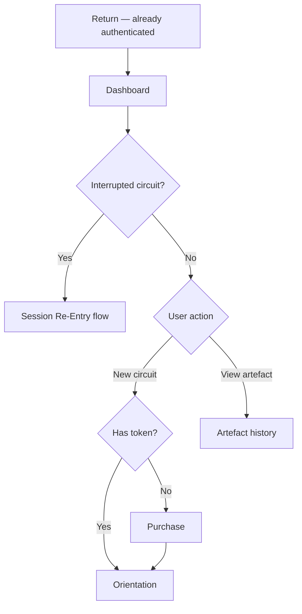

# UX Design Specification BMAD-TRAINING

**Author:** Tone
**Date:** 2026-02-11

---

## Executive Summary

### Project Vision

The Circuit is a constrained professional decision environment — a paid, single-use tool for professionals who have stopped deciding and started researching, hedging, or deferring. The UX must embody "constraint as product": value is in what the system refuses to let you do, not what it provides. The experience is sparse, serious, and slightly exposed by design.

The product creates a new category — constrained professional decision environments — and the UX must establish that category visually and experientially. No precedent exists for the interaction patterns required: language blocking that feels respectful, designed emptiness that reads as intentional, and form-based emotional arcs that track from vulnerability through commitment to silence.

### Design Vocabulary

The Circuit is a witnessed proceeding in a quiet room. The system is the room — it provides structure, enforces procedural rules, and records testimony. The user's words are the record. The system's voice fades as the user's grows — most present at Orientation, absent at exit. State transitions are marked by moments, not announcements. Language blocking is procedural objection, not personal correction. The artefact is a notarised transcript — immutable after commitment, structured by the system's prompts, authored entirely by the user. Eligibility is clinical triage — calm, definitive, respectful. Stop/Go is the moment the stamp falls. The exit is silence after the witness has spoken. The system never evaluates. It witnessed. That's all.

This vocabulary is drawn from cross-domain analysis of analogous experiences — legal depositions, meditation practice, notarisation ceremonies, and medical triage — to provide design reference points for a product category that has no UX precedent.

### Target Users

Four user archetypes, united by a common condition: their work is visible, their judgement is reviewable, and failure has cost.

- **Marcus (Agency Lead)** — Arrives under acute pressure, often on mobile, often late at night. Needs a professional artefact he can share externally. His crucible is Sufficiency — he's never written down what "enough" looks like. Values speed and credibility of output. Will judge the product entirely on whether the artefact is client-facing quality. Zero tolerance for vague error messages — redirect copy must be instant and specific. Target end state: forwards the PDF to his co-founder within 60 seconds of completion without explaining the tool. The artefact explains itself.
- **Priya (Senior IC)** — Self-directed, deeply private. Her crucible is Declaration — writing "I own that" in first person after seven years of "the team decided." Will never share the artefact. Uses it as an internal anchor. Needs a privacy signal before she'll type honestly. Language blocking tone is make-or-break — must feel like the system is holding space, not correcting. Values the exit silence above all — any visual noise at completion breaks the experience. Target end state: sits in designed silence after completion, saves the artefact, and re-reads her own Sufficiency field before sprint planning a week later.
- **Kai (Indie Builder)** — Arrives impulsively, structure-fatigued. His crucible is Sufficiency — naming what he's refusing to build. Values permission to stop. Highest risk for blank-page paralysis at cold start — the orientation scaffold is load-bearing for this user. Needs breathing room before Sufficiency fields. Will screenshot individual fields — they must be visually self-contained. Target end state: screenshots the Sufficiency exclusion field, pins it above his monitor, and ships that evening — first thing he's shipped in five weeks.
- **Dev (Edge Case)** — Capable, curious, not in crisis. His decision fails eligibility. The dignified exit and post-eligibility classification are the entire value. Classification must feel like the real accomplishment, not a consolation prize. Will return only if stopping felt intelligent, not arbitrary. Target end state: closes the tab slightly relieved, and the classification label ("The cost of structuring exceeded the risk") sticks as a reusable lens. Returns three weeks later with a real decision.

### Key Design Challenges

1. **Constraint without hostility** — Language blocking, field limits, and enforced progression must feel like the system respecting the user's intelligence, not punishing their input. Progressive guidance escalation (redirect → scaffold → structured fields) is the primary mitigation. The design analogue is a **structured legal objection** — "Objection: that's a collective statement, not a personal declaration" is procedural and form-based, not personal. Redirect copy must name exactly what was wrong and show the fix pattern immediately. The tone must be neutral-warm, never didactic — "That describes what something else decided. What are *you* deciding?" not "Please rewrite in first person." The first Declaration rejection is the single highest-stakes moment in the product — Marcus either trusts it or leaves. There is no middle ground.
2. **Deliberate emptiness** — Cold start with zero onboarding must read as intentional design, not missing content. The design analogue is the **meditation app's progressive reduction** — the system provides most guidance at Orientation and progressively fades across states until the exit is pure silence. Visual polish must be high even when content is minimal — Marcus will read sparse-but-polished as deliberate and sparse-but-rough as unfinished. Privacy signal must precede the intentionality signal — Priya won't type honestly until she knows this is private-by-default. An explicit, on-screen privacy statement at orientation ("This is private. Only you can see it.") is a UX element, not a legal element. The orientation scaffold ("Do I..." framing as greyed placeholder text inside the input field) is load-bearing, not optional — Kai is at highest risk of blank-page paralysis without it.
3. **Emotional arc through form interaction** — The circuit's states carry the user from uncertainty through vulnerability to commitment to silence. Each state must feel like a distinct environment, not the next field on a form. The design analogue is a **court reporter's transcript** — the user should sense their words are being *recorded*, not just *entered*. Text the user types should render in a typography that feels permanent, not editable. Visual weight must escalate with emotional stakes — Declaration should feel visually heavier than Orientation, Sufficiency heavier still. Resolved in Core Experience: visual weight is defined as spatial density; state transitions use separate pages with cinematic bell transitions; Sufficiency uses visual breathing room without interaction delays. User's own text should be the largest element on screen — typography hierarchy: user input > system prompts > UI chrome.
4. **Designed silence at exit** — The product ends with nothing. No next steps, no upsell, no progress indicator. The design analogue is the **meditation app's ending** — no "Great session!", no evaluation, no feedback. The system witnessed. That's all. Resolved in Core Experience: the finality line dominates the viewport with the artefact's top edge barely visible at the bottom as a scroll affordance. User scrolls when ready. No timer.
5. **Dignified failure states** — Eligibility termination must feel like successful calibration, not rejection. The design analogue is **medical triage** — being sent home from A&E isn't failure, it's the system correctly identifying that your situation doesn't require this level of intervention. "You don't need this level of structure" is a clinical finding, delivered with calm professional confidence, not mysterious gatekeeping. Every exit path must receive the same typographic, spatial, and emotional care as the success path. The eligibility exit sequence must be: statement ("Stopping here is correct") → pause → optional classification. The classification prompt is **departure information** — practical, the user's to keep, not a consolation prize. Classification options must use plain, memorable language — words Dev would actually think in weeks later.
6. **Mobile-first for high-stakes writing** — Declaration and Sufficiency require careful, considered text input. Touch targets ≥44px, spacious text fields, and interaction patterns that support serious thought on a phone screen. Declaration field must be a textarea showing the full sentence without horizontal scrolling. All three Sufficiency fields (enough, excluded, risk) must be simultaneously visible — no tabs, no accordion. The text the user is writing must be the largest thing on screen.
7. **Post-completion flow sequencing** — Resolved in Core Experience: artefact first (below the silence), calibration as quiet coda below the artefact. Sequential, not parallel. Silence → artefact → calibration.

### Design Opportunities

1. **Artefact as marketing vehicle** — The decision record's visual quality directly drives organic growth. The design analogue is a **notarised transcript** — the user's words structured by the system's prompts, with zero system-authored content in the body. Must achieve the aesthetic of a legal brief or executive memo — not a SaaS dashboard export. Clean serif or professional sans-serif typography, generous margins, single accent colour at most. Zero product branding in the artefact body — user's name, date, and decision as the header. The tool is invisible; attribution exists in a small footer only. The web view and PDF must share the same visual language. **Design constraint:** the artefact must work as a complete professional document (Marcus forwards the whole PDF) AND its individual sections must work as standalone visual fragments (Kai screenshots the Sufficiency field). This dual-format requirement needs deliberate design attention.
2. **Absence as design language** — Sparse typography, generous whitespace, no ornamentation. The system's voice follows a **progressive silence** pattern — most present at Orientation (scaffold, privacy statement, framing prompt), progressively fading through Declaration and Sufficiency, near-absent at Stop/Go, and completely silent at exit. The aesthetic communicates constraint. Distinctive visual identity in a market of feature-rich SaaS products.
3. **Language guidance as memorable interaction** — Progressive Declaration blocking creates the product's signature moment: the system refusing to let users hide behind collective voice. Framed as **procedural objection** — about the form of what was said, not the person who said it. This is a binary trust moment — Marcus either trusts the product or leaves at first rejection. The redirect copy is the single highest-stakes piece of microcopy in the entire product.
4. **Session re-entry as emotional checkpoint** — Returning users see their own declaration with "Are you still deciding this?" — transforming state restoration into emotional re-anchoring. Second-time users land directly at orientation with no re-onboarding — **return without re-explanation**, borrowing from the meditation app pattern where the app never re-explains meditation on your second session.
5. **Permission lives in the exclusion** — The "excluded" and "risk" fields in Sufficiency are where the product delivers its core value. For Kai, writing down what he's refusing to build is the mechanism that lets him ship. For Priya, naming what she's letting go of is the relief. These fields must be visually elevated — the exclusion field should be visually distinguished from "enough," perhaps bolder or in a separate container. The refusal is the centrepiece, not a subordinate field.
6. **The user's words are the product** — Across all four personas, the user's own text is the thing they value, return to, screenshot, and forward. The design analogue is the **court reporter's transcript** — the system provides structure, the user provides every word of content. System text is scaffolding; user text is testimony. Typography, spacing, and visual hierarchy must reflect this inversion at every step.
7. **Commitment as notarisation** — The Stop/Go moment is marked with a timestamp — when the commitment was made. The artefact becomes immutable after commitment. Reconsideration doesn't edit the original — it creates a new record alongside it, making change of mind visible rather than hidden. The artefact's authority comes from its structure, not from a mark of approval.

### Cross-Domain Design Reference

| Domain Analogue | Circuit Moment | Design Language |
|----------------|----------------|-----------------|
| Court reporter | All text input | User's words rendered as testimony — permanent typography, not editable-field aesthetic |
| Structured objection | Language blocking | Procedural, form-based ("That's a collective statement") not personal ("You should rewrite this") |
| Transcript | Artefact | User's words structured by system prompts. Zero system-authored content in the body |
| Progressive silence | System voice across states | System text fades across the circuit. Most text at Orientation, least at exit |
| The bell | State transitions | Subtle visual moment marking "something has changed" without progress indicators or step counts |
| No congratulations | Exit state | The system never evaluates. It witnessed. Silence is the acknowledgement |
| Return without re-onboarding | Second circuit | Land at orientation directly. No welcome-back screen |
| Notarial neutrality | Stop/Go interaction | System doesn't question the decision. Presents, witnesses, records |
| Immutable original | Artefact after commitment | No editing post-commitment. Reconsideration creates a new record |
| Clinical triage | Eligibility failure | Calm, definitive, no criteria shared. Professional finding, not rejection |
| Departure information | Post-eligibility classification | Practical, yours to keep. Not consolation — useful classification |

---

## Core User Experience

### Defining Experience

The Circuit is fundamentally a **writing environment under constraint**. The core user action is typing honest, first-person text into constrained fields — the decision framing in Orientation, the justification in Eligibility, the ownership statement in Declaration, the boundaries in Sufficiency, the commitment in Stop/Go.

This inverts the typical UX objective. Most products aim to make the core action effortless. This product deliberately makes the core action effortful. Writing a first-person declaration with consequences is supposed to be hard. Naming what's excluded is supposed to require thought. The effort is the intervention.

The UX goal is therefore: **make the hard thing the only thing.** Remove every friction that isn't the decision itself. Authentication, payment, navigation, state management, export — all invisible. The only thing that requires effort is the writing. The constraint. Every design decision serves this principle: if it adds friction that isn't the decision, eliminate it. If it reduces friction that IS the decision, reject it.

### Platform Strategy

**Platform:** Next.js 16 PWA, mobile-first, server-rendered. Not a native app. Not a traditional SPA. Server Components by default; client components only for the circuit state machine, Stripe checkout, and interactive form fields.

**Primary context:** A professional alone with a consequential decision. Marcus at 10pm on his phone. Priya at her desk after hours. Kai on his laptop on a Saturday afternoon. Dev on his lunch break. The product is used in private, in moments of professional tension, on whatever device is to hand.

**Input method:** Keyboard-primary. The product is a writing environment — touch typing on desktop, thumb typing on mobile. No drag-and-drop, no complex gestures, no multi-select. Writing is the circuit's interaction mode. Everything outside the circuit (calibration capture, commit, purchase, navigation) uses the simplest possible input — single-tap selection, binary choice, one-click actions. The circuit writes. Everything else taps.

**Offline behaviour:** Not offline-first. The circuit requires server-side persistence at every state transition. On connection loss: display "Reconnect to continue" with the user's last-saved state visible but not editable. No silent data loss. The user always knows where they stand.

**PWA capabilities:** Installable for repeat users. Service worker caches static assets (typography, layout, icons) for fast load. Circuit data is never cached client-side — every state reads from and writes to the server.

### State Transition Architecture

**Separate pages with cinematic transitions.** Each circuit state is a distinct page. No progressive reveal. No single-page scroll.

**Rationale:**
- When you complete Declaration and move to Sufficiency, your Declaration disappears. You can't scroll back. You've committed those words. The disappearance is part of the constraint — forward movement is irreversible at the UI level, mirroring the product's irreversibility at the conceptual level.
- Server-side persistence is atomic: validate → persist → navigate → render. No race conditions between client reveal and server state.
- Each state feeling like a distinct environment is achieved through actual page separation — not through trying to make sections of a scrolling page feel different.

**Forward only, within a session.** Once you leave a state, you cannot return to it within the same session. Completed text disappears from view. Session re-entry is a distinct protocol — a re-anchoring ceremony, not backward navigation. On resume, the user sees their own Declaration read-only: "Are you still deciding this?" They can confirm and continue, or abandon. They cannot edit previous states.

**Why this won't feel like a wizard:**
- No step counter. No "Step 3 of 7." No progress bar. No back button.
- The user never knows how many steps remain.
- Transitions are the "bell" — a brief, subtle visual moment (gentle fade, shift in spatial density) that marks progression without announcing position.
- The experience feels like moving deeper into a room, not clicking through a form.

**Transition pattern:** Current state fades → brief visual pause (the bell) → new state renders. The visual pause is not a loading state — it's a designed moment of transition.

**Graceful degradation for connectivity:**
- **Fast connection (<300ms persistence):** The bell pause is purely experiential — a designed moment of approximately 300-500ms
- **Medium connection (300-800ms):** The persistence write fills the bell pause naturally — no visible delay beyond the designed moment
- **Slow connection (>800ms):** The bell pause extends without visual change — no spinner, no loading indicator. The fade holds. The moment simply lasts longer. A 1.5-second fade is a slow breath, not a broken page
- **Critical constraint:** Under no circumstances should a loading spinner or progress indicator appear during a state transition. The transition is always the bell — sometimes a short bell, sometimes a long one. The user should never see technical infrastructure
- **Connection failure:** The fade reverses — the user returns to their current state with a minimal, non-alarming message: "Connection lost. Your work is saved. Reconnect to continue."

### Spatial Density Arc

Visual weight escalates through spatial density — how much breathing room surrounds the user's input at each state:

- **Orientation** — Most spacious. The input field floats in generous whitespace. The system's guidance is most present here (privacy statement, scaffold placeholder). The room is wide open. The user is arriving.
- **Eligibility** — Slightly tighter. The justification field and disqualification prompt sit closer together. The system asks more specific questions. The room is narrowing.
- **Declaration** — Tighter still. Less surrounding whitespace. The field and its constraints (blocking copy, consequence prompt) feel physically closer. The room has focus.
- **Sufficiency** — Densest. Three mandatory fields visible simultaneously. Structural labels name the containers (enough, excluded, risk) but guidance is minimal — the labels are column headers in a deposition, not instructions. The room has narrowed to just the user and their boundaries. This is the crucible — the spatial compression mirrors the cognitive compression of naming what's enough.
- **Stop/Go** — Opens back up. A single commitment statement in wide space. The room breathes again. The decision is crystallising, not compressing.
- **Exit** — Completely open. One line. The rest is air. The room has opened to nothing. The user is alone with their decision.

The arc: open → narrowing → narrowing → dense → opening → vast. Like a breath held and released.

**Scope:** The density arc governs the five active circuit moves (Orientation through Stop/Go). The post-completion page — silence, artefact, and calibration coda — has its own spatial character: the silence inherits Exit's vast emptiness, the artefact uses document-grade density (structured, generous margins, professional), and calibration is spacious and clearly subordinate. These are defined in the Post-Completion Architecture, not the density arc.

**Note:** The density arc communicates emotional intensity, not positional progress. A first-time user should feel "this is getting harder" not "I'm halfway through." If user testing reveals participants describing their position in the sequence rather than their emotional state, the density arc is functioning as an implicit progress indicator and needs dampening.

### The System's Voice

The system's **guidance** fades across the circuit. Its **structure** serves the testimony wherever needed.

- **Orientation** — Most guidance. Privacy statement, scaffold placeholder, framing prompt. The system is setting up the room.
- **Eligibility** — Moderate guidance. The system asks specific questions and assesses eligibility.
- **Declaration** — Guidance appears only on rejection. The blocking copy is procedural (enforcing form), not evaluative (judging content). When the user writes correctly, the system is silent.
- **Sufficiency** — Minimal guidance, maximum structure. Three structural labels name the fields. No instructional text. The labels are containers, not directions.
- **Stop/Go** — Near-silent. A binary choice and two short prompts. The system is barely present.
- **Artefact** — Structural only. Section headings organise the user's testimony. Export and share controls are UI chrome, not system voice. Zero system-authored content in the document body.
- **Calibration** — Structural only. Forced-choice options with no system response to selections.
- **Exit** — One line. Then nothing.

**The critical distinction:** The system enforces procedural rules about the *form* of testimony. It never evaluates the *quality, wisdom, or correctness* of the user's decision. Language blocking is a rule of form — "That's a collective statement, not a personal declaration" — not a judgement of content. This distinction is load-bearing. Every piece of blocking copy, every validation message, every system-authored word must be procedural, never evaluative. If blocking copy ever feels like the system is assessing the *decision* rather than the *form of the declaration*, the product's core promise breaks.

### Effortless Interactions

Everything that isn't the decision must be invisible:

**Authentication** — Magic link or OAuth. One click. No password creation, no verification flow that interrupts the path to the circuit. The user authenticates once and never thinks about it again.

**Token purchase** — Stripe checkout. Minimal fields. One price point at MVP. No cart, no quantity selector, no coupon field. Purchase → confirmation → land at orientation. The purchase-to-first-input latency should be under 60 seconds.

**State persistence** — Invisible. The user never "saves." Every state transition persists automatically. Browser close, device switch, network interruption — the circuit survives. On return, the user sees their own Declaration read-only: "Are you still deciding this?" One tap to continue.

**Artefact export** — One tap for PDF. One toggle for public/private. One tap to copy the share link. No configuration, no format options, no "customise your export." The artefact format is the artefact format.

**Navigation** — Almost none. The circuit is linear. Forward only. The only navigation outside the circuit is: dashboard (credit balance, artefact history) and the circuit itself. No settings page at MVP. No profile page beyond what's needed for auth. The product has almost no UI surface outside the circuit.

**Return flow** — Land at orientation. No welcome-back screen. No "you have X credits remaining" interstitial. The user knows what this is. Respect that. Credit balance visible on the dashboard, not pushed into the circuit flow.

### Critical Success Moments

The moments that determine whether the product works, in order of criticality:

**1. First Declaration rejection (make-or-break)**
The user types "We decided to..." and the system blocks it. This is the single most consequential UX moment in the product. If the blocking feels hostile, the user leaves and never returns. If it feels like a structured procedural objection — about the form of the statement, not the quality of the decision — the user rewrites, and the product has earned trust. The blocking copy must name exactly what was wrong and show the structural fix. Everything downstream depends on this moment landing correctly.

**2. Sufficiency exclusion field (the product's core value)**
The user writes down what they're NOT doing. For many users, this is the first time they've ever been asked to name what they're refusing. The field must feel like a safe place for a hard admission. The spatial density of the Sufficiency state creates natural focus. The exclusion field must be visually elevated — the centrepiece, not the third field in a list.

**3. Exit silence into artefact (psychological closure into tangible value)**
"There is nothing else. This decision is yours now." dominates the viewport. The very top edge of the artefact — just the section divider or the first line of the header — is barely visible at the bottom of the screen, creating a natural scroll affordance without breaking the silence. The user scrolls when ready. This moment determines whether the user feels finality (success) or abandonment (failure). The silence is near-total, the artefact's presence is hinted at, and the scroll is intentional.

**4. Artefact first impression (commercial viability)**
The user scrolls past the silence and sees their decision record. If it looks like a professional document — something you'd attach to an email, pin above a monitor, present to a colleague — the product has commercial legs. If it looks like a form printout, the product dies regardless of how good the circuit experience was. The artefact is the product's ambassador.

**5. Eligibility exit (dignified failure)**
Dev's decision doesn't qualify. "Stopping here is correct." If this feels like triage — calm, clinical, definitive — Dev leaves with a useful classification and returns three weeks later. If it feels like rejection, he doesn't come back.

### Post-Completion Architecture

After Stop/Go commit, the experience sequences as follows:

1. **The silence** — Finality line dominates the viewport. The very top edge of the artefact is barely visible at the bottom of the screen — enough to signal content below without breaking the silence. User scrolls to continue. No timer, no fade-in. Just the line, the space, and a hint of what's below.
2. **The artefact** — Below the silence. The user's complete decision record. Structured as a notarised transcript: user's words structured by system prompts, zero system-authored content in the body. User's name, date, and decision as the header. No product branding in the body. A timestamp marking when the commitment was made — no visual seal, no badge. The artefact's authority comes from its structure, not from a mark of approval. Attribution in a small footer only. Export (PDF), share (URL with public/private toggle), and save controls immediately accessible.
3. **The calibration coda** — Below the artefact. "Before you go: what changed?" Three optional forced-choice prompts. Clearly an epilogue, not a gate. Priya engages carefully. Marcus may never scroll this far. The calibration is value-adding but never value-blocking.

This sequencing ensures: silence is near-total → artefact is findable and immediately accessible → calibration is optional and unhurried. Each user finds what they need at their own pace.

### Typography Architecture

Two typographic modes reflecting the transition from input to record:

- **Input mode** — Clean, comfortable, slightly informal typeface. The field feels like a space to think. Generous line height. The user is composing.
- **Record mode** — After state transition, the user's submitted text re-renders with a subtle increase in weight and formality. The shift must be **subliminal, not dramatic** — a slight weight increase within the same type family, not a font family change. The user should feel "my words are more serious now" without being able to articulate why. If user testing reveals people commenting on the font change, the shift is too prominent. The gold standard: gravitas, not animation.

Within the artefact, everything renders in record mode. The artefact typography must match between web view and PDF — the same typeface, the same weight, the same spatial treatment. No quality drop between screen and print.

**Typography hierarchy across all states:**
1. User's text (largest, most prominent — record mode after submission)
2. System prompts and field labels (smaller, lighter, subordinate)
3. UI chrome and controls (smallest, most recessive)

### Experience Principles (Authoritative)

These principles consolidate the foundational principles from Project Understanding with the architectural principles from Core Experience. This is the single authoritative set governing all UX decisions.

| # | Principle | Implication |
|---|-----------|------------|
| 1 | **Make the hard thing the only thing** | Remove every friction that isn't the decision. Auth, payment, navigation, export — invisible. If it adds friction that isn't the decision, eliminate it. If it reduces friction that IS the decision, reject it |
| 2 | **The user's words are the product** | User text is always the largest, most prominent element. System text is subordinate. The circuit writes; everything else taps. Typography hierarchy: user input > system prompts > UI chrome |
| 3 | **Artefact before apparatus** | The output must be usable outside the product — as a complete document and as individual section fragments. Zero product branding in the artefact body. The artefact is a transcript, not a report |
| 4 | **The room narrows, then opens** | Spatial density tracks emotional stakes. Orientation is wide. Sufficiency is compressed. The exit is vast. The user feels the arc through space, not through labels |
| 5 | **Forward only, within a session** | Each state transition is irreversible at the UI level. Completed text disappears. Session re-entry re-anchors read-only but does not reopen previous states for editing |
| 6 | **Guidance fades, structure serves** | The system's instructional voice recedes across the circuit. Structural labels remain where the testimony requires them. By Stop/Go the system is barely present. At exit, one line then silence |
| 7 | **Procedural rules, never content judgement** | The system enforces form (first person, owned consequence). It never evaluates quality, wisdom, or correctness. Language blocking is a rule of evidence, not feedback on the decision. This distinction is load-bearing |
| 8 | **Silence is a feature, not an absence** | Moments of emptiness are designed with the same care as moments of content. Exit silence is near-total. The system never evaluates, never congratulates. It witnessed |
| 9 | **Permission lives in the exclusion** | The "excluded" and "risk" fields deliver the product's core value. They must be visually elevated, not buried as subordinate fields |
| 10 | **Failure states deserve equal design investment** | Every exit path receives the same typographic, spatial, and emotional care. Eligibility failure is triage, not rejection |
| 11 | **Privacy precedes vulnerability** | Privacy signal is a UX element, not a legal element. On-screen, at orientation, plainly stated — before the user types anything honest |
| 12 | **Momentum without rush** | State transitions are the bell — sometimes short, sometimes long, never a spinner. Visual breathing room at high-stakes moments. No forced pauses |
| 13 | **Commitment is a timestamp, not a seal** | Stop/Go marks the moment with a timestamp. The artefact is immutable after commitment. Reconsideration creates a new record. No visual seal — the artefact's authority comes from its structure, not a mark of approval |
| 14 | **Show the value, then ask for classification** | Artefact before calibration. The user holds what they produced before being asked to reflect on how they produced it |

---

## Desired Emotional Response

### Primary Emotional Goals

The Circuit produces **clarity through ownership** — the user should feel the weight of what they've decided, and that weight should feel like relief. This is not a product that aims for delight, satisfaction, or accomplishment. The target emotional state at completion is *stillness after testimony*: the user has spoken, the record exists, and the room is quiet.

Three primary emotional goals govern the design:

1. **Honesty feels safe** — The user writes truthfully about consequential decisions because the environment signals privacy, non-judgement, and structural respect. The system holds space; it does not evaluate.
2. **Constraint feels like permission** — Limitations on what the user can write (first person, no hedging, explicit exclusions) are experienced as the system granting permission to be direct, not as the system correcting mistakes.
3. **Completion feels like gravity** — The end of the circuit is weighty and still. Not celebratory, not rewarding, not "done!" The user has committed words to an immutable record. The appropriate response is silence.

### Emotional Journey Mapping

| State | Primary Emotion | What the User Feels | Design Signal |
|-------|----------------|---------------------|---------------|
| **Pre-circuit** | Professional tension | "I've been avoiding this" | The product meets existing tension — it doesn't manufacture it |
| **Orientation** | Grounding, safety | "I can be honest here" | Privacy statement, scaffold placeholder, generous whitespace. The calm of an empty room before proceedings begin |
| **Eligibility** | Slight exposure | "Am I in the right place?" | Clinical assessment, not interrogation. Dev's journey ends here — with recognition ("Stopping here is correct"), not rejection |
| **Declaration** | Vulnerability → trust | "I'm saying this out loud, in my name" | The language blocking moment is the emotional fulcrum. If it lands as procedural objection: trust. If it lands as correction: hostility. The rewrite should feel like the user admitting what they already knew |
| **Sufficiency** | Relief through constraint | "I'm allowed to stop here" | Naming what's excluded is simultaneously the hardest and most freeing moment. The spatial compression mirrors cognitive compression. The exclusion field is the centrepiece — permission to refuse |
| **Stop/Go** | Gravity, finality | "This is mine now" | The timestamp falls. Not celebration, not reward. The weight of having committed words to record. A single moment, then the room opens |
| **Exit silence** | Solitude, stillness | "I did that. The room is quiet" | Near-total silence. The system has stepped back. The user is alone with their testimony. Not loneliness — the respectful withdrawal of a witness who has done their part |
| **Artefact** | Recognition, professional pride | "This is what I decided, and it looks serious" | The artefact renders the user's words as a professional document. The feeling is "I produced something real" |
| **Calibration** | Gentle reflection | "What changed in me?" | An unhurried epilogue. No obligation. The reflection is a gift, not a gate |

### Micro-Emotions

The standard UX emotional axes (Confidence/Confusion, Delight/Frustration) are secondary for this product. The load-bearing micro-emotional distinctions are:

| Axis | Target State | Failure State | Where It's Critical |
|------|-------------|--------------|-------------------|
| **Exposure ↔ Safety** | Vulnerable but protected | Exposed and judged | Declaration, Sufficiency |
| **Ownership ↔ Blame** | "I'm claiming this" | "I'm being corrected" | Declaration blocking, all system copy |
| **Permission ↔ Obligation** | "I'm allowed to stop" | "I must justify my limits" | Sufficiency fields, especially exclusion |
| **Gravity ↔ Dread** | "This is final" | "This is frightening" | Stop/Go commit, artefact immutability |
| **Solitude ↔ Abandonment** | "The system stepped back" | "The system left me" | Exit silence, artefact transition |
| **Recognition ↔ Consolation** | "Stopping was correct" | "Better luck next time" | Eligibility failure, classification |

**Emotions to actively prevent across all states:**

- **Shame** — Especially during language blocking. The system objects to form, never to the person
- **Performance anxiety** — No word counts, no quality indicators, no implicit evaluation. The system never signals "good answer"
- **Abandonment** — Exit silence is designed, not absent. The artefact's visible edge is the signal that the system is still present
- **Confusion about state** — Uncertainty about what to write is acceptable and sometimes productive. Uncertainty about where the user is or whether the system is functioning is never acceptable
- **Triviality** — The user's decision must never feel small. Every typographic and spatial choice honours the seriousness of what they're committing

### Design Implications

Each micro-emotional axis maps to specific UX decisions:

**Exposure ↔ Safety**
- Privacy statement at Orientation is a UX element, not a legal one — "This is private. Only you can see it."
- No social features, no sharing prompts within the circuit
- No analytics-revealing UI (no "23 people made decisions today")

**Ownership ↔ Blame**
- All blocking copy uses procedural language about form, never evaluative language about content
- Redirect patterns name what was wrong structurally and show the fix pattern — "That describes a collective decision. What are *you* deciding?"
- No "try again" or "please rewrite" — the system restates the requirement, not the failure

**Permission ↔ Obligation**
- Sufficiency fields use structural labels (enough, excluded, risk), not instructional prompts
- No minimum word counts on any field
- The exclusion field is visually elevated, signalling that naming limits is the purpose, not a secondary task

**Gravity ↔ Dread**
- Stop/Go uses calm, minimal language — no dramatic warnings, no "are you sure?" anxiety patterns
- The timestamp is factual, not ceremonial
- Commitment is irreversible but not punitive — reconsideration creates a new record, not an amendment

**Solitude ↔ Abandonment**
- Exit silence is near-total, but the artefact's top edge is barely visible — signalling continuation without breaking stillness
- No "session complete" message. No summary. No "what's next?" The finality line is the only system utterance
- The user scrolls when ready — the system never pushes them past the silence

**Recognition ↔ Consolation**
- Eligibility exit uses clinical, definitive language: "Stopping here is correct"
- Classification prompt is departure information, offered after a pause, using plain memorable language
- The exit path receives identical typographic and spatial treatment to the success path

### Emotional Design Principles

These principles extend the authoritative Experience Principles (Section: Core User Experience) into the emotional domain:

1. **The system holds space; it does not evaluate** — Every interaction must feel like structured witnessing, not assessment. No implicit judgement through word choice, animation, colour, or timing
2. **Vulnerability is met with structure, not warmth** — The response to a user writing something honest is not encouragement ("Great!") but structure ("Recorded."). Warmth patronises; structure honours
3. **Permission is the product's emotional core** — The Sufficiency exclusion field, the eligibility exit, the designed silence — the recurring emotional thread is the system granting permission: to stop, to leave, to be finished
4. **Gravity accumulates, then releases** — The emotional arc builds weight through Declaration and Sufficiency, reaches its peak at Stop/Go, then opens into silence. The release is spatial (vast whitespace), not verbal (no "well done")
5. **Designed silence is the highest-fidelity emotional signal** — More emotionally precise than any copy, animation, or visual element. The exit silence communicates: "What you said matters. There is nothing to add."

---

## UX Pattern Analysis & Inspiration

### Framing Note

This section was pressure-tested through First Principles Analysis and restructured accordingly. The Circuit's design identity was largely invented in Steps 2–3 — the design vocabulary (witnessed proceedings, procedural objection, the bell, spatial density arc) emerged from cross-domain analysis, not from studying competitor products. The inspiration analysis below is therefore organised by what it actually contributes: confirmation of existing decisions, genuinely new design intelligence, and an honest acknowledgement of where no existing product provides guidance.

### Design References (Confirmatory)

These products validate architectural decisions already made. They are useful as implementation reference points — "what does this principle look like in practice?" — not as source material for the design.

**iA Writer — Radical input simplicity**
Confirms Principle 2 ("The user's words are the product"). iA Writer's single typeface, no formatting toolbar, hidden word count, and focus mode demonstrate that the absence of options is itself a design choice. The circuit's input fields should inherit this austerity: no formatting, no character count, no save button. The field *is* the state.

**Implementation reference:** How a professional writing tool communicates "your words are the only thing here" through the absence of chrome.

**Headspace — Progressive reduction within a session**
Confirms Principle 6 ("Guidance fades, structure serves"). Headspace's first session has extensive instruction; by session ten, the voice says almost nothing. The circuit compresses this into a single session (Orientation is guided, exit is silent), but the emotional logic is identical. Headspace also confirms our no-evaluation principle — after meditation, the screen shows stillness, not "Great session!"

**Implementation reference:** What progressive instruction reduction feels like in practice, and how post-session stillness communicates completion more effectively than any message.

**Typeform — One thing per viewport**
Confirms the separate-pages architecture decided in Step 3. Typeform's full-screen transitions between questions demonstrate that each question owning the entire viewport creates psychological separation between inputs. Their observation that visual breathing room scales with question importance mirrors our spatial density arc.

**Implementation reference:** Transition timing between full-viewport screens, and how spatial generosity communicates cognitive weight.

**Day One — Privacy enables honest writing**
Confirms Principle 11 ("Privacy precedes vulnerability"). Day One's end-to-end encryption is a product feature that enables the honesty of the writing — the privacy promise unlocks vulnerability. Our on-screen privacy statement serves the same emotional function through a different mechanism.

**Implementation reference:** How a writing product positions privacy as a feature that enables honesty, not as a compliance checkbox.

### Genuinely Additive Patterns

These patterns contribute design intelligence not already present in the specification.

**DocuSign's preview → pause → commit (Stop/Go mechanics)**
The Stop/Go state's interaction mechanics were underspecified. DocuSign's signing experience provides a concrete pattern: before the user commits, they see a preview of what they're committing. There's a deliberate pause — the user reads their own words rendered in the commitment frame before confirming. This transforms a button press into a moment.

**New design decision:** Stop/Go should render the user's Declaration and Sufficiency responses in record-mode typography *before* the commit action. The user reads their own testimony as it will appear in the artefact, then commits. The preview is the ceremony. No additional confirmation dialog, no "are you sure?" — just the user's words, rendered seriously, and the commit action.

**Day One's quality-jump-on-export (Artefact standard)**
Day One lets users export journal entries as a printed book. The quality jump — from app entry to physical book — validates the user's writing as worth preserving. This establishes a measurable design target for the artefact:

**New design standard:** The artefact must look *better* than the input experience. The quality jump from input mode to artefact should be visible and immediate — the user's words, which they typed in a clean but functional input field, now render as a professional document they'd attach to an email. If the artefact looks like a form printout of the input experience, the quality jump has failed.

**Headspace's post-session screen (Exit silence implementation)**
The exit silence principle was established in Step 3 but its on-screen implementation was abstract. Headspace's post-meditation screen provides a concrete reference: a single visual element (an expanding dot) in an otherwise empty screen. No text. No action. Just a visual anchor in stillness.

**New implementation reference:** The exit silence screen should have one dominant element (the finality line) surrounded by designed emptiness. The artefact's top edge barely visible at the bottom provides a second, subordinate visual anchor. Everything else is negative space. The screen should feel like a held breath — complete, still, and waiting for the user to move.

### Anti-Patterns to Avoid

| Anti-Pattern | Why It's Toxic for This Product | Governing Principle |
|-------------|-------------------------------|-------------------|
| **Gamification** (streaks, counters, achievements) | Reduces testimony to metrics. The decision is not an achievement to be tracked | Principle 8: Silence is a feature |
| **Celebratory completion** (confetti, "well done!", progress celebrations) | Implies the system evaluates. Any celebration means it could also disapprove | Emotional Principle 1: The system does not evaluate |
| **Progress indicators** (step counters, progress bars, "3 of 7") | Transforms the emotional arc into a completion metric. "I'm halfway" replaces "this is getting harder" | Principle 4: The room narrows, then opens |
| **Rich text editing** (formatting toolbars, bold/italic, font choices) | Shifts attention from what the user says to how it looks | Principle 2: The user's words are the product |
| **Auto-save toasts** ("Saving...", sync indicators) | Makes infrastructure visible. State persistence must be invisible | Principle 1: Make the hard thing the only thing |
| **"Are you sure?" dialogs** (confirmation modals, warning popups) | Creates anxiety at the commitment moment. Gravity, not dread | Emotional Principle 4: Gravity accumulates, then releases |
| **Back/undo navigation** (back buttons, undo history, edit previous) | Contradicts forward-only architecture. Disappearance is the constraint | Principle 5: Forward only, within a session |
| **Social proof** ("Join 10,000 professionals", usage stats) | Violates privacy-as-UX and reduces the decision's singularity | Principle 11: Privacy precedes vulnerability |
| **Onboarding tours** (tooltips, walkthroughs, coach marks) | The circuit is self-explanatory. Orientation's scaffold is the only guidance | Principle 6: Guidance fades, structure serves |
| **Loading spinners** (progress wheels, skeleton screens during transitions) | Technical infrastructure must be invisible. The bell extends, never becomes a spinner | Principle 12: Momentum without rush |

### Where Original Design Is Required

First Principles Analysis revealed that the product's most distinctive interactions have **no existing analogues** in the inspiration products — or in any mainstream digital product. These are the moments that will require original UX invention during wireframing and prototyping.

**1. Language blocking interaction (Declaration state)**
The single highest-stakes UX moment in the product. The system blocks the user's text and provides a procedural redirect. No mainstream product does this — the closest analogues are form validation and CAPTCHA, both universally negative experiences. The challenge: invent an interaction pattern where being told "no" feels like structured guidance, not correction. The blocking must be inline (not a modal), immediate (not delayed), and the redirect copy must show the fix pattern without repeating the failure. This moment will likely require multiple prototype iterations and real-user testing. No amount of inspiration analysis substitutes for testing this with Marcus at 10pm on his phone.

**2. Eligibility rejection (Eligibility state)**
Telling a user their decision doesn't qualify, and making that feel like successful calibration rather than rejection. No product in the inspiration set rejects users gracefully — DocuSign doesn't say "you shouldn't sign this," Headspace doesn't say "you don't need to meditate." The medical triage analogue from Step 2 provides the emotional framework (clinical finding, not rejection), but the on-screen implementation — the copy, the pacing, the optional classification prompt as departure information — requires original design. Dev's experience is the entire test case.

**3. Session re-entry ("Are you still deciding this?")**
Returning users see their own Declaration read-only with a re-anchoring prompt. No inspiration product does this. Headspace's "welcome back" is warm and encouraging — the wrong register entirely. The circuit's re-entry must be confrontational in a structural sense: presenting the user with their own words and asking if they still stand behind them. This is emotionally closer to a witness being recalled to the stand than to an app welcoming a returning user. Original interaction pattern required.

**4. Dual-format artefact**
The artefact must work as a complete professional document (Marcus forwards the whole PDF) AND as individual screenshot-able sections (Kai pins the Sufficiency exclusion field above his monitor). No inspiration product addresses this dual requirement. Day One's export provides a quality standard but not a structural solution for content that must be both unified and fragment-able. The typography, spacing, and visual containment of individual sections must be designed to work at both scales — a design constraint that will require explicit attention during artefact layout.

### Design Inspiration Strategy

**Adopt as implementation reference:**
- iA Writer's input austerity — for field design across all circuit states
- Headspace's post-session stillness — for exit silence screen composition
- Typeform's viewport-per-question timing — for state transition pacing
- Day One's privacy-as-feature positioning — for Orientation privacy statement

**Adopt as new design intelligence:**
- DocuSign's preview → pause → commit — for Stop/Go interaction mechanics
- Day One's quality-jump-on-export — as measurable artefact standard

**Reject entirely:**
- Any gamification, streaks, or achievement framing
- Any celebratory or evaluative completion pattern
- Any progress indication revealing position in sequence
- Any social proof, usage statistics, or community signals
- Any rich text or formatting capability
- Any confirmation dialog at commitment moments

**Invent from scratch:**
- Language blocking interaction pattern (Declaration)
- Dignified rejection experience (Eligibility)
- Session re-entry as emotional re-anchoring
- Dual-format artefact layout (complete document + screenshot-able fragments)

---

## Design System Foundation

### Design System Choice

**cu.css (CUBE CSS + Utopia fluid responsive framework) with fully custom components.** No component library. No pre-built UI kit. No Sass dependency.

The Circuit's visual identity — sparse, typographically driven, emotionally weighted — cannot be achieved by theming an existing component library. The product has minimal UI surface and maximal typographic requirements. cu.css provides a lightweight foundation (~15kb) that combines CUBE CSS methodology with Utopia's fluid responsive design, using CSS Custom Properties as tokens with zero external dependencies. For a product built on designed absence, the tooling should be equally minimal — plain CSS, nothing generated, nothing to purge, nothing to compile.

### Rationale for Selection

**Why cu.css:**
- **CUBE CSS methodology, pre-integrated.** Composition (viewport layouts, density arc containers), Utility (spacing/typography tokens), Block (custom circuit components), Exception (state-specific overrides). Maps directly to the circuit's state-based architecture — and cu.css implements CUBE CSS as its structural foundation
- **Utopia fluid responsive design, built in.** Fluid typography and spacing via `clamp()` functions ship with cu.css. The circuit's need for responsive layouts that feel intentional across devices — Marcus on his phone, Priya at her desk — is handled natively without manual clamp configuration
- **CSS Custom Properties as tokens.** No Sass variables, no build-time generation step, no compilation dependency. Tokens are CSS custom properties, readable in any browser's dev tools, editable in any text editor, compatible with any build pipeline. The tokens *are* the CSS
- **Zero dependencies, zero build tooling.** No Sass. No PostCSS. No purge step. Next.js serves the CSS as-is. Zero client-side runtime. No hydration penalty. No Turbopack compatibility concerns
- **Nothing unless authored.** Utilities are hand-crafted as needed, not generated and pruned. For a product with fewer than 20 distinct UI elements, this is the correct approach — every class exists because a designer wrote it for a specific purpose
- **Global-first styling.** cu.css applies most styling at the HTML element level, requiring minimal additional classes. This "low-class" approach produces cleaner markup and lets the cascade work as designed — philosophically aligned with a product where every element exists because it was deliberately placed

**Why cu.css over Gorko:**
- Gorko requires Sass compilation. cu.css is plain CSS — the Sass/Turbopack edge case risk identified in pre-mortem analysis is eliminated entirely
- Gorko requires learning a Sass-based configuration syntax. cu.css uses standard CSS Custom Properties — any front-end developer can read and modify the tokens immediately
- Gorko generates utilities from a config file. cu.css's hand-crafted utilities are more appropriate for a product with this few UI elements — the generation step adds complexity without proportional benefit
- cu.css already integrates Utopia, which we'd have configured manually with Gorko. The fluid typography and spacing foundation ships ready

**Why not Tailwind CSS:**
- Tailwind generates comprehensive utility sets and removes unused classes via purge. For a product with fewer than 20 distinct UI elements, this is architecturally inverted — building everything to discard most of it
- Tailwind's extensive default configuration contradicts the product's principle of deliberate minimalism

**Why not a component library:**
- The circuit's signature interactions (language blocking, the bell, spatial density, designed silence) exist in no component library
- The product's UI surface is 90% constrained text input and 10% minimal dashboard — component libraries are built for the inverse ratio
- Component library conventions (modals, toasts, dropdowns, tooltips) are explicitly listed as anti-patterns for this product

### Implementation Approach

**Dual token architecture — circuit and artefact:**

The CSS Custom Properties are organised into two rendering contexts with distinct requirements:

- **Circuit tokens (fluid):** Responsive, Utopia-generated `clamp()`-based typography and spacing for the interactive circuit states. These scale fluidly across devices — Marcus on his phone and Priya at her desktop see the same density arc at proportional scales. No breakpoint jumps. cu.css's Utopia integration provides this natively
- **Artefact tokens (fixed):** Static, document-grade typography and spacing for the artefact renderer and PDF output. The artefact is a document, not a responsive layout — it has one canonical rendering. Fixed tokens ensure web view and PDF output are visually identical, eliminating the `clamp()` computation divergence that would occur between a browser viewport and a headless PDF renderer at a fixed width. Implemented as a second set of CSS Custom Properties scoped to the artefact context

Both token sets derive from the same design scale. The circuit's fluid values and the artefact's fixed values are siblings, not strangers — the type sizes, spacing ratios, and colour values share a common ancestor in the custom property definitions.

**Design tokens (CSS Custom Properties, organised by concern):**
- **Typography tokens** — Two modes (input, record) with the subliminal weight shift within the same type family. Circuit: Utopia fluid type scale using `clamp()`. Artefact: fixed type scale at document size
- **Spacing tokens** — Density arc values for each circuit state (Orientation: generous, Sufficiency: compressed, Exit: vast). Circuit: Utopia fluid spacing using `clamp()`. Artefact: fixed spacing for document layout
- **Colour tokens** — Minimal. Near-monochrome with a single accent colour at most. Shared across both contexts. cu.css's automatic dark mode support available if needed
- **Transition tokens** — The bell's timing values (300–500ms designed pause, extended graceful degradation) as custom properties
- **Touch targets** — Minimum 44px interactive areas as a spacing token (circuit context only)

**CUBE CSS architecture (via cu.css):**
- **Composition** — Full-viewport layouts for circuit states. The density arc is a composition concern — each state's container defines its spatial character. cu.css's composition layer provides the structural foundation
- **Utility** — Hand-crafted utilities for spacing, typography, colour, and responsive adjustments. Only what's needed exists — authored deliberately, not generated and filtered
- **Block** — Custom circuit components: constrained text input, bell transition, language blocking UI, artefact renderer, eligibility exit, session re-entry, dashboard
- **Exception** — State-specific overrides. Declaration's tighter density. Sufficiency's compressed three-field layout. Exit's vast emptiness. Exceptions are explicit and traceable

**Custom component layer:**
- Circuit state containers (full-viewport, density-arc-aware compositions)
- Constrained text input (input mode → record mode typography shift)
- Bell transition (CSS-based, no JavaScript animation library)
- Language blocking UI (inline procedural objection — original design, no precedent)
- Artefact renderer (professional document layout, web + PDF parity via fixed tokens, dual-format)
- Eligibility exit (clinical finding, optional classification, equal design investment)
- Session re-entry (read-only Declaration with re-anchoring prompt)
- Dashboard (credit balance, artefact history, start action — minimal)

**No additional UI dependencies:**
- No Framer Motion (the bell is CSS transitions, not JavaScript animation)
- No Sass (cu.css is plain CSS with custom properties)
- No component library (no modals, no dropdowns, no popovers needed)
- PDF generation via server-side library — not a client-side PDF kit

### Customisation Strategy

cu.css is a starting point, not a constraint. The design system is authored from the token layer upward:

1. **Extend cu.css's token layer** — Override and extend the CSS Custom Properties for typography scale (input/record modes, fluid/fixed), spacing scale (density arc per state), colour palette, and transition timing. The custom properties encode the product's design principles as code
2. **Build circuit components as CUBE blocks** — Each block is purpose-built for its circuit state. No generic "Card" or "Form" components. A Declaration state container knows its spatial density, its typography mode, and its blocking UI behaviour
3. **Artefact as separate rendering context** — A scoped set of fixed CSS Custom Properties for web view and PDF parity. Shares the design scale but not the responsive behaviour of circuit tokens
4. **Non-circuit surfaces inherit the token language** — Dashboard, auth, and purchase surfaces use the same tokens in simpler compositions. The visual language is consistent; the complexity is reserved for the circuit

### Risk Mitigations

The move from Gorko to cu.css eliminates two of the five risks identified in pre-mortem analysis. Remaining risks are low-severity:

| Risk | Severity | Mitigation |
|------|----------|------------|
| ~~Developer unfamiliarity with Gorko~~ | ~~High~~ → **Eliminated** | cu.css uses standard CSS Custom Properties. Any front-end developer can read and modify tokens immediately |
| ~~Sass/Turbopack compilation edge case~~ | ~~Medium~~ → **Eliminated** | cu.css is plain CSS. No Sass, no compilation step, no build tool compatibility concerns |
| **PDF breaks fluid token chain** | High (eliminated by dual tokens) | Resolved by the dual token architecture — artefact uses fixed custom properties, circuit uses Utopia fluid tokens. The rendering contexts are separated at the CSS scope level |
| **cu.css update divergence** | Low | cu.css is a starting point, not a runtime dependency. Once forked into the project, updates are optional. The framework is ~15kb of readable CSS — the entire codebase is auditable in one sitting |
| **Missing utility during implementation** | Low | Hand-craft the utility as needed. For a product with fewer than 20 UI elements, this is the expected workflow, not an edge case |

**Portability clause:** The design system is CSS Custom Properties, CUBE CSS methodology, and purpose-built components. cu.css provides the starting scaffold. If the project outgrows cu.css, the tokens and architecture migrate trivially — they're already standard CSS. No generator lock-in, no build tool dependency, no migration cost beyond file reorganisation.

---

## 2. Core User Experience

### 2.1 Defining Experience

**"Write your decision down, in your own name, with consequences."**

That's what a user would say if asked to describe The Circuit in one sentence. Not "fill in a decision form." Not "get a structured framework." The defining interaction is the act of committing honest, first-person text — knowing the system will hold you to the form of what you say, and that the record is permanent.

The product's competitive identity lives in this: the system refuses to let you hide. Every other decision tool asks "what did you decide?" The Circuit asks "what are *you* deciding, and what are you refusing?"

### 2.2 User Mental Model

Users arrive with mental models from adjacent experiences. Every expectation will be broken. The breaks must feel deliberate, not broken.

| Expectation | Reality | Design Implication |
|------------|---------|-------------------|
| "This is a form — I'll fill it out and submit" | Each state is a separate environment. Completed text disappears. There is no review page | The bell transition must signal "you've moved somewhere new," not "the next field loaded" |
| "I can edit what I wrote" | Forward only. No back button. No revision within a session | The absence of back navigation must feel like commitment architecture, not missing functionality |
| "The system will tell me if my answer is good" | The system evaluates form, never content. It will block "we decided" but not a bad decision | Blocking copy must be unmistakably procedural. Any hint of content evaluation destroys trust |
| "There's a progress bar or step count" | No positional indicators. The density arc communicates weight, not position | Spatial density changes must feel emotional ("this is getting harder") not navigational ("I'm halfway") |
| "The system will say 'well done' at the end" | Silence. One line. Then the artefact | The exit silence must feel designed, not absent. The artefact's top edge is the only signal of continuation |
| "I can come back and edit my decision" | The record is immutable. Reconsideration creates a new record | Immutability must feel like notarisation, not punishment. The timestamp is the mechanism of permanence |

### 2.3 Success Criteria

Measurable conditions for user testing — each maps to a specific circuit moment:

| Test Area | Success Condition | Failure Signal |
|-----------|------------------|----------------|
| **Declaration blocking** | User rewrites their statement in first person within 30 seconds of the first block, without expressing frustration | User says "that's annoying," closes the tab, or asks how to skip |
| **Sufficiency exclusion** | User pauses visibly before writing in the exclusion field, then writes with visible relief or determination | User treats the exclusion field identically to the "enough" field — no emotional differentiation |
| **Exit silence** | User sits in the silence for at least 3 seconds before scrolling. When asked afterward, describes the feeling as "final" or "quiet" or "done" — not "empty" or "broken" | User scrolls immediately past the silence, or asks "is that it?" or looks for a missing element |
| **Artefact first impression** | User's first reaction references quality, professionalism, or shareability — "I could send this" or "this looks real" | User's first reaction references the tool — "oh, that's what it generated" or "where's the export?" |
| **Eligibility exit** | Dev describes the exit as informative or useful — "it told me this wasn't the right tool" or references the classification | Dev describes the exit as rejection — "it said I couldn't use it" or "I failed the test" |
| **Spatial density** | User describes emotional arc ("it got harder in the middle" or "it opened up at the end") without referencing position | User describes positional progress ("I was about halfway" or "three screens in") — the density arc is leaking as a progress indicator |

### 2.4 Novel UX Patterns

Four interactions that have no existing analogues and require original design invention:

**1. Language blocking (Declaration)**
The system blocks text that doesn't meet procedural requirements — collective voice, hedging language, absence of personal ownership. The block must be inline, immediate, and the redirect must show the structural fix without repeating the failure. The closest analogues (form validation, CAPTCHA) are universally negative. The challenge: invent an interaction where being told "no" builds trust.

*Design direction:* The block appears as inline text below the field — not a modal, not a toast, not a red border. The redirect copy is warm-procedural: "That describes a collective decision. What are *you* deciding?" The user's original text remains in the field, editable. No deletion, no reset. The system names the structural issue and shows the pattern; the user rewrites.

**2. Eligibility rejection (Eligibility)**
Telling a user their decision doesn't qualify and making it feel like successful calibration. The clinical triage analogue provides the emotional framework; the on-screen implementation requires original design.

*Design direction:* Statement first ("Stopping here is correct"), then a pause (the user reads the statement alone on screen), then optional classification as departure information. The classification options use plain, memorable language — phrases Dev would actually think in weeks later. The typography and spacing match the success path exactly.

**3. Session re-entry ("Are you still deciding this?")**
Returning users see their own Declaration read-only with a re-anchoring prompt. Emotionally closer to a witness being recalled than an app welcoming a returning user.

*Design direction:* The user lands on a page showing their Declaration text in record-mode typography. One question: "Are you still deciding this?" Two actions: continue or abandon. No explanation of the circuit, no welcome-back copy, no credit balance. The user confronts their own words.

**4. Dual-format artefact**
The artefact must work as a complete professional document (Marcus forwards the PDF) and as individual screenshot-able sections (Kai pins the exclusion field). Typography, spacing, and visual containment must work at both scales.

*Design direction:* Each artefact section has its own visual container with clear boundaries — section heading, content, breathing room. The full document reads as a unified professional record. An individual section, when cropped, reads as a self-contained statement. Shared typography, consistent section rhythm, and clear visual edges at every section boundary.

### 2.5 Experience Mechanics

**The Circuit (5 active moves — separate pages with bell transitions):**

**Orientation**
- *Initiation:* User arrives from dashboard or purchase flow. The page is spacious — most whitespace in the entire circuit. Privacy statement visible: "This is private. Only you can see it."
- *Interaction:* Single text field with scaffold placeholder ("Do I..."). The user frames their decision. No word limit, no formatting. The field is the state.
- *Feedback:* None. The system does not evaluate the framing. When the user submits, the bell transition fires.
- *Completion:* Text persists server-side. The page fades (the bell). Orientation disappears. The user cannot return.

**Eligibility**
- *Initiation:* New page renders after the bell. Slightly tighter spatial density — the room is narrowing.
- *Interaction:* The system presents structured questions to assess whether the decision qualifies for the circuit. The user writes a justification. The system assesses eligibility based on structural criteria (not content quality).
- *Feedback:* Binary outcome. If eligible: bell transition to Declaration. If not eligible: the eligibility exit path — "Stopping here is correct" → pause → optional classification as departure information. Dev's journey ends here with equal design investment.
- *Completion:* Eligible users advance. Ineligible users receive classification and exit with dignity.

**Declaration**
- *Initiation:* Tighter density still. Less whitespace. The field and its constraints feel physically closer.
- *Interaction:* The user writes their ownership statement in first person. Language blocking is active — collective voice, hedging, and absence of personal ownership trigger inline procedural redirects. The redirect names the structural issue and shows the fix pattern.
- *Feedback:* On valid input: silence. The system says nothing when the form is correct. On invalid input: inline redirect copy (warm-procedural, never evaluative). The user's text remains in the field, editable. No deletion.
- *Completion:* Valid Declaration accepted. Bell transition. Declaration disappears. The user has committed these words.

**Sufficiency**
- *Initiation:* Densest state. Three fields visible simultaneously — enough, excluded, risk. Structural labels name the containers. No instructional text. The room has narrowed to just the user and their boundaries.
- *Interaction:* Three text fields. "Enough" defines what success looks like. "Excluded" names what the user is refusing to do — the centrepiece, visually elevated. "Risk" names what the user accepts could go wrong. No minimum word counts.
- *Feedback:* None. The system does not evaluate content. The spatial compression and the exclusion field's visual elevation do the emotional work.
- *Completion:* All three fields submitted. Bell transition. Sufficiency disappears.

**Stop/Go**
- *Initiation:* The room opens. Wide space. The density compresses and releases.
- *Interaction:* **Preview first** — the user's Declaration and Sufficiency responses render in record-mode typography. The user reads their own testimony as it will appear in the artefact. The preview is the ceremony. Then: a binary choice. Commit or abandon. A timestamp marks the moment of commitment. No "are you sure?" dialog. No confirmation modal.
- *Feedback:* On commit: the timestamp falls. The artefact becomes immutable. On abandon: the circuit ends without a record. Both paths receive equal design investment.
- *Completion:* Commit triggers the final bell transition to the post-completion page.

**Post-Completion (single scrollable page — no bell transitions):**

**Exit Silence**
- *Position:* Top of the post-completion page, filling the viewport.
- *Experience:* "There is nothing else. This decision is yours now." dominates the screen. The artefact's top edge — just the section divider or first header line — is barely visible at the bottom, creating a scroll affordance without breaking the silence. No timer, no fade-in. The user scrolls when ready.
- *Spatial character:* Inherits Exit's vast emptiness. Near-total silence. One line, then air.

**Artefact**
- *Position:* Below the silence, revealed by scrolling.
- *Experience:* The user's complete decision record in document-grade typography (fixed artefact tokens). Structured as a notarised transcript — user's words structured by system section headings, zero system-authored content in the body. User's name, date, and decision as the header. Timestamp of commitment. No product branding in the body. Export (PDF), share (URL with public/private toggle), and save controls immediately accessible. Quality jump from input mode — the artefact must look *better* than the input experience.
- *Spatial character:* Document-grade density — structured, generous margins, professional. Distinct from the circuit's fluid density arc.

**Calibration Coda**
- *Position:* Below the artefact, revealed by further scrolling.
- *Experience:* "Before you go: what changed?" Three optional forced-choice prompts. Clearly an epilogue, not a gate. No system response to selections. Priya engages carefully. Marcus may never scroll this far.
- *Spatial character:* Spacious, minimal, clearly subordinate to the artefact above.

---

## Visual Design Foundation

### CSS Architecture

**Modern CSS baseline (production-ready, all major browsers).** The design system uses current CSS capabilities — no preprocessors, no polyfills, no progressive enhancement required for core features.

**Cascade management via `@layer`:**
```
@layer reset, base, composition, utility, block, exception;
```
Maps directly to CUBE CSS methodology. Layer order eliminates specificity conflicts without `!important`.

**`@property` registered custom properties** for type-safe, animatable design tokens. The bell transition's input→record weight shift is a CSS-only animation on a registered `@property` value — no JavaScript animation library.

```css
@property --text-weight {
  syntax: "<number>";
  inherits: true;
  initial-value: 400;
}
```

### Colour System

**Near-monochrome in `oklch` colour space.** The Circuit's visual identity is typographic, not chromatic. Colour does almost nothing. Space and weight do everything. `oklch` provides perceptually uniform lightness — equal numeric changes produce equal perceived changes, and `color-mix(in oklch)` produces clean derived variants without the muddy midtones of mixing in `srgb`.

**Core palette:**

| Token | Value | Usage |
|-------|-------|-------|
| `--surface` | `oklch(0.98 0.005 80)` | Page background, the "room" — warm off-white |
| `--ink` | `oklch(0.15 0.01 80)` | User's text (testimony), blocking redirect copy |
| `--system` | `oklch(0.55 0.005 80)` | System prompts, field labels, UI chrome |
| `--accent` | `oklch(0.55 0.06 55)` | Artefact section rules, heading treatments — structural, never decorative |
| `--boundary` | `oklch(0.82 0.005 80)` | Artefact section dividers, screenshot containment edges |
| `--recessive` | `oklch(0.72 0.005 80)` | Disabled states, placeholder text |

**Derived variants via `color-mix()`:**

```css
--ink-subtle: color-mix(in oklch, var(--ink) 60%, transparent);
--accent-hover: color-mix(in oklch, var(--accent) 85%, black);
--surface-raised: color-mix(in oklch, var(--surface) 95%, var(--ink));
```

**Semantic colour mapping:**
- **Primary action:** `--ink` (commit button, primary controls)
- **Blocking redirect:** `--ink` in italic — redirect copy is testimony-grade communication, not system chrome. Priya must read it as the system speaking *to her*, not muttering alongside her
- **System guidance:** `--system` (prompts, labels, scaffold text)
- **Artefact structural accent:** `--accent` (section rules, heading underlines, structural edges)
- **Error/warning:** None at MVP. The circuit has no error states — only procedural redirects (`--ink` italic) and eligibility exits (full testimony typography)

**Dark mode readiness** via `light-dark()` — not needed at MVP, but the architecture supports it at zero additional cost when the time comes.

**Deliberate constraint:** No blues, greens, or reds in the palette. No semantic colour for success/error. The circuit is not a form — it doesn't have "valid" and "invalid" states.

### Typography System

**Source Serif 4 (variable font, weight range 200–900).** A single type family across the entire product. The variable weight axis provides quality shifts between modes without font-family changes. Variable font ships as a single `.woff2` file — smaller than loading multiple static weights.

**Font loading:**

```css
@font-face {
  font-family: 'Source Serif 4';
  src: url('/fonts/SourceSerif4-Variable.woff2') format('woff2');
  font-weight: 200 900;
  font-display: swap;
  font-optical-sizing: auto;
}
```

`font-size-adjust` normalises x-height against the system fallback font, reducing layout shift during the `font-display: swap` window on first load. One property, real benefit for text stability in a product where the user's words are the primary visual element.

**Type modes (all sizes in `rem`, fluid values via Utopia `clamp()`):**

| Mode | Weight | Scale | Context |
|------|--------|-------|---------|
| **Input** | 400 | Fluid: Utopia `clamp()` from `1rem` to `1.25rem` | User composing text in active fields |
| **Record** | 500 | Same fluid scale | User's submitted text — subliminal gravitas shift via `@property` animated weight transition |
| **Artefact body** | 500 | Fixed: `1.125rem` — one scale step above circuit body | Decision record body. Quality jump = scale step + wider margins + accent structural work |
| **Artefact heading** | 600 | Fixed: `1.375rem` | Section headings. `--accent` underline rule beneath each |
| **System** | 300 | Fluid: one step below body in Utopia scale | System prompts, labels — always subordinate |
| **Redirect** | 400 italic | Same fluid scale as input | Blocking redirect copy — italic distinguishes from user text while maintaining testimony-grade presence |

**Why `rem` for artefact "fixed" tokens:** The artefact tokens don't use `clamp()` with viewport units (they render at a single size), but they're still in `rem` — if a user has set their browser to a larger base font for accessibility, the artefact respects that. "Fixed" means "not viewport-fluid," not "ignores user preferences."

**Type scale (Utopia fluid, circuit context):**
- Viewport range expressed in `rem` (not `px`)
- Scale: ~1.2 (minor third)
- All steps expressed as `clamp()` values generated by Utopia via cu.css
- Viewport unit in the `clamp()` formula uses whatever unit cu.css/Utopia generates — this is an implementation detail, not a design decision

**Heading treatment:** `text-wrap: balance` on all headings — prevents orphaned words. Production-ready in all browsers, zero cost.

**Quality-jump specification (Marcus test):** The artefact must look visibly *better* through three simultaneous signals: (1) larger type at a fixed `rem` scale, (2) wider margins via spacing tokens, (3) `--accent` doing structural work via section rules and heading treatments. Weight 400→500 alone is subliminal — the artefact needs supraliminal elevation.

### Spacing & Layout Foundation

**Spacing shorthands as default writing style.** `margin-block`, `padding-inline`, `inset`, `gap` — the modern shorthands that reduce code and express intent clearly. Not a mandate to convert every physical property (e.g. `width` stays `width`, not `inline-size`), but the shorthands are the natural way to write spacing in 2026.

**Viewport units: `dvh` / `svh`** — never bare `vh`. Each circuit state fills the dynamic viewport height (`100dvh`), accounting for mobile browser chrome appearing/disappearing. Marcus on his phone at 10pm sees a full-screen state, not content hidden behind the address bar.

**Utopia fluid spacing scale (circuit tokens):**
- Viewport range expressed in `rem`
- Base spacing unit: fluid `clamp()` values in `rem`
- Scale multiplier: consistent with type scale (~1.2)
- Tokens: `--space-3xs` through `--space-3xl`, each a `clamp()` value generated by cu.css/Utopia
- All gap, margin, and padding values reference these tokens

**Density arc mapping (circuit states):**

| State | Spatial Character | Primary Token Range | Field Padding |
|-------|------------------|--------------------:|---------------|
| **Orientation** | Most spacious — the room is wide open | `--space-xl` to `--space-3xl` | Generous |
| **Eligibility** | Slightly tighter — the room narrows | `--space-l` to `--space-xl` | Moderate |
| **Declaration** | Tighter still — focus and constraint | `--space-m` to `--space-l` | Compact |
| **Sufficiency** | Densest — the crucible | `--space-s` to `--space-m` | Compressed |
| **Stop/Go** | Opens — the room breathes again | `--space-xl` to `--space-2xl` | Generous |

**Layout approach:**

- **CSS Grid** for page-level composition — each circuit state is a grid layout with named areas
- **CSS Grid + subgrid** for artefact section containment — artefact sections align to a parent grid, enabling consistent boundaries for Kai's screenshot extraction
- **Flexbox** for 1D component internals (button groups, inline controls, action bars)
- **`gap`** for all spacing between siblings — no margin hacks

**Mobile-first single column:**
- Content column: `min(100% - 2 * var(--space-m), 42.5rem)` — fluid with a readable maximum
- Artefact column: `min(100% - 2 * var(--space-m), 45rem)` — slightly wider for document-grade reading
- Side margins: `var(--space-m)` minimum (`padding-inline`)

**Post-completion spacing:**
- Exit silence: `min-block-size: 100dvh` — fills the viewport. `overscroll-behavior: contain` prevents scroll chaining back to the circuit or triggering pull-to-refresh — the exit silence must feel like a contained environment
- Artefact: document-grade margins, `--accent` section rules, clear structural edges
- Calibration: spacious, subordinate, clearly epilogue

**Artefact section containment (Kai test):** Containment is structural, not chromatic: (1) visible `--boundary` block-start and block-end rules via CSS Grid row lines, (2) generous internal `padding-block`, (3) `--accent` heading underline providing the top edge, (4) clear whitespace via `gap`. Subgrid ensures section boundaries align to the parent document grid. A screenshot of any single section reads as a complete, bounded statement.

**Eligibility exit affordance (Dev test):** The eligibility exit mirrors the silence→artefact scroll pattern: statement dominates the viewport, classification prompt's top edge barely visible at the block-end — a scroll affordance. `scroll-padding-block-start` ensures the classification lands cleanly when scrolled to.

### Accessibility Considerations

**Standard: WCAG 2.2 AA conformance, with selective AAA adoption.** WCAG 2.2 became a W3C Recommendation in October 2023. AA is the legal and regulatory standard. AAA is adopted selectively where it serves this product's users.

**WCAG 2.2 criteria addressed:**

| Criterion | Level | Relevance to The Circuit |
|-----------|-------|-------------------------|
| **2.4.11 Focus Not Obscured (Min)** | AA | No sticky headers or overlays obscure focused elements. Single-column, full-viewport — focus is always visible |
| **2.5.7 Dragging Movements** | AA | Not applicable — zero drag interactions. All input is text or single-tap |
| **2.5.8 Target Size (Min)** | AA | Exceeds requirement: minimum 44×44 CSS pixels (`2.75rem`), well above the 24×24 AA floor |
| **3.2.6 Consistent Help** | A | If help is provided, it appears in the same relative order across pages |
| **3.3.7 Redundant Entry** | A | Session re-entry pre-populates the user's Declaration read-only — no re-entry of previously submitted data |
| **3.3.8 Accessible Auth (Min)** | AA | Magic link or OAuth — no cognitive function test. Password fields support paste/autofill if used |

**Selective AAA adoption:**

| Criterion | Level | Why we adopt it |
|-----------|-------|----------------|
| **2.4.13 Focus Appearance** | AAA | 2px perimeter area, 3:1 contrast. The circuit is keyboard-heavy — focus must be unmistakable |
| **2.5.5 Target Size (44px)** | AAA | Already our minimum. High-stakes mobile writing demands generous touch targets |
| **1.4.6 Contrast Enhanced (7:1)** | AAA | `--ink` on `--surface` exceeds 7:1. The near-monochrome palette naturally achieves this |

**Colour contrast (oklch-calculated):**
- `--ink` on `--surface`: ≥ 12:1 (exceeds WCAG AAA)
- `--system` on `--surface`: ≥ 4.5:1 (meets WCAG AA)
- `--accent` on `--surface`: ≥ 4.5:1 (meets WCAG AA — accent is structural, not body text)
- Redirect copy (`--ink` italic): same ≥ 12:1 — critical communication

**User preference media queries (required):**

- `prefers-reduced-motion: reduce` — the bell transition becomes instantaneous. All CSS transitions suppressed. The emotional arc is preserved through spatial density, not motion
- `prefers-contrast: more` — `--system` and `--recessive` shift toward `--ink`. Boundaries become more prominent
- `forced-colors: active` — all custom colours yield to system colour keywords (`CanvasText`, `Canvas`, `Highlight`). Focus indicators use `Highlight`

**Typography accessibility:**
- Minimum body text: `1rem` (fluid, never smaller — respects user's browser base size)
- Line height: 1.5 unitless for body, 1.2 unitless for headings
- `font-size-adjust` normalises x-height against fallback stack
- Source Serif 4's italic forms are clear and distinct at all sizes

**Keyboard navigation:**
- Full keyboard accessibility for all circuit states
- Tab order follows visual flow (block-start to block-end, single column)
- Focus indicators: `--ink` outline, 2px solid, 2px offset — meeting 2.4.13 AAA (2px perimeter, 3:1 contrast)
- Enter/Return submits text fields (writing-environment mental model)
- Focus never obscured (2.4.11 AA) — no sticky elements, no overlays within the circuit

**Screen reader considerations:**
- State transitions announced via ARIA live regions — "Declaration" not "Step 3 of 7"
- Blocking redirect copy associated with the triggering field via `aria-describedby`
- `accent-color: var(--accent)` styles native form controls (calibration checkboxes) without custom ARIA
- Artefact uses semantic heading hierarchy for screen reader navigation

**Removed from WCAG 2.2:** 4.1.1 Parsing is no longer a success criterion. Valid HTML remains best practice, not a conformance requirement.

---

## Design Direction Decision

### Design Directions Explored

Three immersive design directions were generated as full-fidelity, scrollable HTML showcases — each presenting the complete circuit arc (Orientation → Eligibility → Declaration → Sufficiency → Stop/Go → Exit Silence → Artefact) with realistic, emotionally resonant content rather than placeholder text.

**I. Considered** — Centred alignment, largest type scale, maximum spatial generosity. The centred axis creates a natural vertical reading corridor — the eye has nowhere to wander. Body text at `clamp(1.125rem, 0.95rem + 0.6vw, 1.375rem)`, user input at `clamp(1.3125rem, 1.05rem + 0.9vw, 1.6875rem)`, system prompts at weight 300. Content width 42.5rem. The most ceremonial of the three — each state feels like a separate room in a quiet building.

**II. Efficient** — Left-aligned, tighter type scale, faster reading cadence. Body text at `clamp(1rem, 0.88rem + 0.4vw, 1.1875rem)`, content width 38rem. System prompts in small-caps at 0.8125em with generous letter-spacing. Designed for Priya and Marcus — professionals who read quickly and value density over ceremony. The density arc is still present but subtler.

**III. Intimate** — Narrow column (32rem), largest body text of all three, maximum line height (1.75). System prompts italic at weight 300. Designed for the user who needs the most breathing room — Kai at his most structure-fatigued. The narrow column creates a reading experience closer to a book than an interface.

All three directions shared the same foundational decisions: near-monochrome ink-opacity hierarchy (100%, 78%, 48%, 28% of a single ink colour rather than separate greys), Source Serif 4 variable font throughout, `contenteditable` divs instead of textarea elements, layered box-shadows for paper elevation on the artefact, and scroll-reveal animations via IntersectionObserver.

### Chosen Direction

**I. Considered** — selected as the primary design direction for The Circuit.

The centred alignment creates a natural vertical reading axis that guides the user downward through the circuit states. The largest type scale honours the principle that the user's words are the product. The maximum spatial generosity supports the density arc's full range — from vast openness at Orientation to meaningful compression at Sufficiency.

### Design Rationale

- **Centred alignment corridor effect** — With a 42.5rem content column centred in the viewport, the left and right margins create natural boundaries that channel attention downward. This vertical corridor is the spatial equivalent of the circuit's forward-only constraint — there is one direction to go
- **Largest type scale supports testimony weight** — User input text at `clamp(1.3125rem, 1.05rem + 0.9vw, 1.6875rem)` with weight 500 makes the user's words physically dominant. System text at weight 300 and one scale step smaller is visibly subordinate. The typography hierarchy is self-enforcing
- **Scroll-snap containment** — `scroll-snap-type: y mandatory` on the HTML element with `scroll-snap-align: start` on each circuit state creates distinct "rooms" that the user moves between. Combined with 2.5rem × 2px visual bell dividers between states, the user knows when they've entered a new environment without any step counter or progress indicator
- **Artefact paper elevation** — The artefact renders on a warm paper surface (`#FEFDFB`) with layered box-shadows (four layers at low opacity) that create convincing depth without ornamentation. The quality jump from circuit input to artefact output is immediate and visible — the user's words look *better* as a document than they did as input

### Implementation Approach

- **CSS Custom Properties per direction** — The Considered direction's values (`--content-width: 42.5rem`, `--text-align: center`, `--body-size`, `--user-size`, `--system-size`, `--user-weight: 500`, `--system-weight: 300`, `--body-lh: 1.65`) become the production token set. Direction-level custom properties allow future A/B testing between directions without structural changes
- **Ink opacity hierarchy** — `rgba(26, 26, 24, 1)` as primary text, `0.78` for secondary, `0.48` for tertiary, `0.28` for ghost. This maps to the oklch colour system in the Visual Foundation — opacity variants of `--ink` rather than separate colour tokens. Rules at `0.10` and `0.18` opacity for structural dividers
- **Scroll-snap architecture** — `scroll-snap-type: y mandatory` on the root with `scroll-snap-align: start` on each circuit state. The colophon/calibration section uses `scroll-snap-align: none` to allow free scrolling at the end of the circuit. The artefact snaps normally to ensure clean transition from exit silence
- **`contenteditable` over `textarea`** — Input fields use `contenteditable` divs styled to match the surrounding typography exactly. This eliminates the visual break between input and surrounding text, supporting the principle that the user's words are the product — not content trapped in a form control
- **Artefact paper rendering** — A contained element with warm background, 2px border-radius, and four-layer box-shadow creates document-grade presentation. Internal padding uses artefact fixed tokens. Section dividers use `--accent` colour. The artefact's visual language is deliberately distinct from the circuit — it's a document, not a screen

---

## User Journey Flows

### Flow 1: Primary Circuit (Happy Path)

The complete path through the circuit — Marcus's commitment, Priya's ownership, Kai's exclusion.



**State-by-state interaction detail:**

**Orientation** — The room is wide open.
- User arrives from dashboard or purchase flow
- Privacy statement visible: "This is private. Only you can see it."
- Single field with scaffold placeholder: "Do I..."
- User frames their decision in their own words
- No validation, no evaluation — the system accepts any framing
- Submit → bell transition → text persists server-side, page disappears

**Eligibility** — The room narrows.
- System presents structured assessment questions (criteria never revealed)
- User writes justification for why this decision warrants structure
- Binary outcome assessed on structural criteria (consequence, irreversibility, personal stakes) — never content quality
- **Pass:** Token consumed. Bell transition to Declaration
- **Fail:** → Eligibility Exit flow. Token preserved

**Declaration** — Focus and constraint.
- Two inputs: ownership statement ("I am deciding to...") and consequence acknowledgement ("If X happens, I own that")
- Language blocking active on the ownership statement:
  - **1st rejection:** Redirect copy — names the structural issue, shows the fix pattern. "That describes a collective decision. What are *you* deciding?"
  - **2nd rejection:** Structural scaffold — the field transforms to show "I am deciding to ___" as a fillable frame
  - **3rd rejection:** Structured fields — the free-text field converts to constrained sub-fields (subject: "I", verb: "am deciding to", object: ___, consequence: ___)
- User's original text remains in the field — no deletion, no reset
- On valid input: silence. The system says nothing when the form is correct
- Submit → bell transition → Declaration disappears. Words committed

**Sufficiency** — The crucible.
- Three fields visible simultaneously — no tabs, no accordion, no progressive reveal:
  - **Enough:** "What does success look like?" — defines the boundary of completion
  - **Excluded:** "What are you refusing to do?" — the centrepiece, visually elevated. Permission to refuse
  - **Risk:** "What could go wrong?" — names the accepted downside
- No minimum word counts. No system evaluation of content
- All three mandatory. Submit → bell transition

**Stop/Go** — The room opens.
- **Preview:** Declaration and Sufficiency responses render in record-mode typography — the user reads their own testimony as it will appear in the artefact
- **Defence prompt:** "Your rejected alternative was [X]. Why isn't that actually better?" — a structured challenge drawn from the user's own inputs. Write-in response
- **Downside:** "What happens if this goes wrong?" — the user names the worst case
- **Reconsideration trigger:** "What would make you reconsider?" — the user names the condition for reversal
- **Commit or Abandon.** No confirmation dialog. No "are you sure?"
  - Commit: timestamp falls. Artefact becomes immutable. Bell transition to post-completion
  - Abandon: circuit ends. No record. Equal design investment in the exit

**Exit Silence** — One line, then air.
- "There is nothing else. This decision is yours now." dominates the viewport
- Artefact's top edge barely visible at the bottom — scroll affordance without breaking silence
- No timer, no fade-in. The user scrolls when ready

**Artefact** — The record.
- Complete decision record in document-grade typography (fixed artefact tokens)
- Structured as notarised transcript: user's words structured by system section headings
  - Decision framing (from Orientation)
  - Ownership statement + consequence (from Declaration)
  - Defence prompt response (from Stop/Go)
  - Sufficiency: enough, excluded, risk (from Sufficiency)
  - Downside + reconsideration trigger (from Stop/Go)
  - Commitment timestamp
- Zero system-authored content in the body. User's name, date, and decision as header
- Export (PDF), share (URL + public/private toggle), save — immediately accessible
- No product branding in the body. Attribution in small footer only

**Calibration Coda** — The epilogue.
- "Before you go: what changed?"
- Three optional forced-choice prompts — no system response to selections
- Clearly subordinate to the artefact. An epilogue, not a gate

---

### Flow 2: Eligibility Exit (Dev's Path)

The dignified failure — successful calibration, not rejection.



**Interaction sequence:**

1. **Statement** — "Stopping here is correct." Appears alone on screen in testimony-grade typography. Not a modal. Not an error. A clinical finding. The spacing and weight match the success path exactly — Dev's screen looks as deliberate as Marcus's
2. **Designed pause** — The statement sits alone. The user reads it. No timer, no progress. The classification prompt's top edge is barely visible at the bottom of the viewport — the same scroll-affordance pattern as the artefact peek below exit silence
3. **Classification prompt** — "Which property made this decision unsuitable for structure?" Options in plain, memorable language:
   - "The cost of structuring exceeded the risk"
   - "The decision closed without resistance"
   - "Someone else owns the consequence"
   - "The outcome is easily reversible"
   - Optional free-text (50-char cap)
4. **Exit** — Token preserved with clear confirmation. No retry coaching. No "try a different decision." The exit is complete

**Emotional sequence:** Clinical finding → pause for absorption → practical departure information → clean exit. At no point does the system suggest the user did anything wrong.

---

### Flow 3: Session Re-Entry

The re-anchoring ceremony — a witness recalled to the stand.



**Interaction detail:**

1. **Trigger:** User has an incomplete circuit (completed at least Declaration, interrupted before Stop/Go commit). Returns via dashboard, direct link, or PWA
2. **What they see:** Their own Declaration text rendered in record-mode typography. No welcome-back screen. No "you were working on..." No credit balance. Just their own words, rendered seriously
3. **The question:** "Are you still deciding this?" — One question. Two actions. Continue or abandon. The question is confrontational in a structural sense: the user must face what they wrote and decide whether it still stands
4. **Continue:** User resumes at the state immediately after their last completed state. All previous state data preserved. No re-entry of previously submitted information (WCAG 2.2 §3.3.7)
5. **Abandon:** Circuit ends. No record. Token already consumed (at eligibility pass). The abandonment is a valid ending, not a penalty

**What's absent:** No re-onboarding. No explanation of the circuit. No "welcome back." No indication of how many states remain.

---

### Flow 4: First-Time Purchase

Discovery to first input — the critical funnel.



**Interaction detail:**

1. **Discovery:** User arrives via content marketing (long-form essay, social referral, word of mouth). No free trial, no demo, no feature tour
2. **Landing page:** Product positioning. Single CTA to authenticate. Sparse, serious, intentional — the landing page should feel like the product
3. **Authentication:** Magic link or OAuth. One click. No password creation, no email verification flow that interrupts the path
4. **Token purchase:** Stripe checkout. One price point at MVP. No cart, no quantity selector, no coupon field
5. **Dashboard:** Credit balance visible. "Start" action prominent. No onboarding tooltip, no product tour
6. **First Orientation:** Privacy statement. Scaffold placeholder. The room is open

**Critical latency:** Purchase-to-first-input under 60 seconds. Every screen between Stripe confirmation and the Orientation text field is friction that isn't the decision.

**PRD diagnostic:** Track token-purchase-to-first-orientation latency. If median exceeds 7 days, the purchase flow is disconnected from decision readiness. One optional post-purchase question: "What prompted this purchase?"

---

### Flow 5: Return User

The efficient re-entry — respect what they already know.



**Interaction detail:**

1. **Dashboard state:** Credit balance. Artefact history (previous decision records). Start action. Purchase action (if no tokens). No re-onboarding. No "welcome back"
2. **Interrupted circuit:** If the user has an incomplete circuit, the dashboard surfaces it — but doesn't force re-entry. User can resume (→ Session Re-Entry flow) or start fresh (previous incomplete circuit abandoned)
3. **Artefact history:** Previous decision records listed by date and decision framing (from Orientation). Each opens to the full artefact with export/share controls. No cross-decision analytics at MVP
4. **New circuit:** If tokens available, one tap to Orientation. No interstitial. Second-time users land at Orientation with no re-explanation

**What's absent:** No settings page at MVP. No profile page beyond auth. No notification centre. No activity feed. The dashboard exists to start circuits and access artefacts. Nothing else.

---

### Journey Patterns

Patterns extracted across all five flows:

**Forward-Only Progression**
Every flow moves in one direction. The circuit is linear. Session re-entry doesn't reopen previous states. The artefact is immutable. Abandonment doesn't produce a partial record. No back button anywhere in the product.

**The Bell as Emotional Punctuation**
State transitions within the circuit use the bell — a designed pause that marks "you've moved somewhere new." The bell is never a loading state. It extends gracefully under slow connections. Within post-completion, transitions are scroll-based — no bells, just the user choosing to continue downward.

**System Silence on Valid Input**
When the user writes correctly, the system says nothing. Feedback is reserved exclusively for form violations (language blocking). Valid input → silence → bell → next state. The absence of feedback IS the feedback.

**Equal Design Investment for All Exits**
Four possible endings: circuit completion, eligibility exit, Stop/Go abandon, session re-entry abandon. Each receives the same typographic, spatial, and emotional care. No exit is a "failure state."

**Preview Before Commitment**
The user reads their own words in record-mode before the commit action. The preview IS the ceremony. No additional confirmation dialog; the visual weight of their own rendered words is the confirmation.

**Privacy Signal Before Vulnerability**
Orientation's privacy statement precedes any text input. Dashboard shows no social features, no usage statistics. The product never reveals that other users exist.

**Scroll as Consent**
Post-completion transitions are user-initiated scrolling. Each section's top edge peeks below the current viewport — a scroll affordance, not a push. The user moves at their own pace. The system never auto-scrolls.

---

### Flow Optimisation Principles

**1. Every exit is a valid completion**
Eligibility failure, Stop/Go abandon, and circuit completion are all designed endings. The product never communicates "you didn't finish."

**2. Friction is the feature, not a defect**
Language blocking, field constraints, and enforced progression ARE the product. The declaration rejection is the product's signature interaction. If it becomes smoother, the product loses its mechanism.

**3. The user's words travel forward; the user does not**
Text persists across the circuit — from Declaration to Stop/Go preview to artefact. The user cannot revisit states, but their words accumulate into the record.

**4. System presence inverts across the journey**
Most guidance at Orientation. Less at Eligibility. Blocking copy only at Declaration. Labels only at Sufficiency. Near-silent at Stop/Go. One line at exit. Then nothing. The direction is always toward silence.

**5. One primary action per state**
Each circuit state has exactly one core interaction: write and submit. No tabs, no modals, no secondary workflows. The complexity lives in what the user writes, not in what the interface offers.

---

## Component Strategy

### Design System Coverage

**cu.css provides (foundation layer):**
- CSS reset with sensible defaults
- Utopia fluid type scale (CSS Custom Properties with `clamp()`)
- Utopia fluid spacing scale (CSS Custom Properties with `clamp()`)
- CUBE CSS layer structure (`@layer reset, base, composition, utility, block, exception`)
- Global-first styling — low-class markup, cascade-driven
- `prefers-reduced-motion` and `prefers-contrast` media query hooks

**cu.css does not provide:**
- Pre-built UI components of any kind
- JavaScript behaviours
- Form controls beyond browser defaults
- Layout patterns beyond basic composition

**Gap:** Everything. The Circuit's entire component layer is custom-authored. cu.css provides the token vocabulary and methodology; the components are ours.

---

### Custom Components

#### Circuit Components

**1. Circuit State Container**

**Purpose:** Full-viewport wrapper that establishes the spatial character — density, breathing room, centred alignment — for each of the five active circuit moves.

**Usage:** One per active circuit state. Each state page renders exactly one container. Not nested, not composed with other containers.

**Anatomy:**
- Outer wrapper: `100dvh` minimum height, flex column, centred content
- Inner content column: `min(100% - 2 * var(--space-m), 42.5rem)`, centred horizontally
- Density is controlled via state-specific spacing tokens applied to the wrapper's `padding-block`

**States:**
- **Active:** Visible, interactive. The current circuit state
- **Transitioning-out:** Opacity fading to 0 during the bell. No pointer events
- **Transitioning-in:** Opacity rising from 0 after the bell pause. Content renders during fade-in
- **Gone:** Removed from DOM after transition completes. Not hidden — removed

**Variants (density):**

| State | `padding-block` range | Character |
|-------|----------------------|-----------|
| Orientation | `--space-xl` to `--space-3xl` | Vast — the room is open |
| Eligibility | `--space-l` to `--space-xl` | Narrowing |
| Declaration | `--space-m` to `--space-l` | Tight — focus |
| Sufficiency | `--space-s` to `--space-m` | Densest — the crucible |
| Stop/Go | `--space-xl` to `--space-2xl` | Opening — the room breathes |

**Accessibility:**
- `role="main"` on the active container (one per page)
- State name announced via ARIA live region on transition: "Declaration" not "Step 3"
- No `aria-hidden` on transitioning states — they're removed from DOM, not hidden
- Focus moves to the primary input field after transition completes

**Interaction Behaviour:**
- No direct user interaction with the container itself
- Contains exactly one primary action (text input + submit)
- `overscroll-behavior: contain` prevents scroll chaining on mobile
- `scroll-snap-align: start` (production: separate pages, so snap applies to the post-completion scroll context only)

---

**2. Constrained Text Input**

**Purpose:** The product's primary interaction element. A text input that looks like surrounding typography rather than a form control. Supports the principle that the user's words are the product — not content trapped in a form field.

**Usage:** Every circuit state that accepts text: Orientation (decision framing), Eligibility (justification), Declaration (ownership + consequence), Sufficiency (enough, excluded, risk), Stop/Go (defence response, downside, reconsideration trigger).

**Anatomy:**
- `contenteditable` div styled to match surrounding typography
- No visible border in default state
- Subtle focus indicator: `--ink` outline, 2px solid, 2px offset (WCAG 2.4.13 AAA)
- Placeholder text in `--recessive` colour, system weight (300), disappears on focus
- Submit action outside the field (button or keyboard shortcut)

**States:**
- **Empty:** Placeholder visible. Field at input-mode typography (weight 400, fluid body size)
- **Composing:** User is typing. Placeholder hidden. Text renders at input-mode weight (400). No character count, no word count, no formatting toolbar
- **Blocked:** (Declaration only) User's text remains in field, editable. Language blocking UI appears below. Field does not change visual state — no red border, no error styling
- **Submitted:** Text transitions to record-mode (weight 500) via `@property` animated weight shift. The shift is subliminal — 400→500 within the same font family. Duration: 200ms
- **Read-only:** (Session re-entry, Stop/Go preview) Record-mode typography. Not editable. No focus indicator. No cursor

**Variants:**

| Context | Size | Placeholder |
|---------|------|-------------|
| Orientation | Fluid body size | "Do I..." |
| Eligibility | Fluid body size | None — system prompt provides context |
| Declaration (ownership) | Fluid user size (one step up) | "I am deciding to..." |
| Declaration (consequence) | Fluid body size | "If this goes wrong..." |
| Sufficiency fields | Fluid body size | None — structural labels serve as context |
| Stop/Go fields | Fluid body size | None |

**Accessibility:**
- `role="textbox"` with `aria-multiline="true"`
- `aria-label` describes the field purpose: "Your decision framing", "Your ownership statement"
- `aria-describedby` links to any blocking redirect copy (Declaration)
- `aria-placeholder` for the scaffold text
- Enter/Return does not submit — it creates a newline (writing-environment mental model). Separate submit button or Cmd/Ctrl+Enter for submission
- Minimum touch target: 44×44 CSS pixels for the field area

**Interaction Behaviour:**
- Typing is immediate — no debounce, no auto-save toast, no character counter
- Paste is permitted — no paste-blocking
- No rich text — `contenteditable` with `plaintext-only` attribute where supported, fallback CSS strips formatting
- On submission: field content persists server-side. No "saving..." indicator. State transition begins (bell)
- Input-to-record weight shift happens on submission via CSS `@property` animation, before the bell fires

---

**3. Bell Transition**

**Purpose:** The designed pause between circuit states. Marks "you've moved somewhere new" without announcing position. The bell is emotional punctuation, never a loading indicator.

**Usage:** Between each of the five active circuit states (4 transitions total), and once more from Stop/Go commit to post-completion.

**Anatomy:**
- Phase 1: Current state fades out (opacity 1→0). Duration: 150–250ms
- Phase 2: Brief visual pause. Empty viewport at `--surface` colour. Duration: 150–250ms (the "bell moment")
- Phase 3: New state fades in (opacity 0→1). Duration: 150–250ms
- Total designed duration: 450–750ms
- Visual bell divider: 2.5rem × 2px rule at `--text-tertiary` (48% ink opacity) — visible at the top of the incoming state

**States:**
- **Idle:** No transition in progress
- **Fading-out:** Current state opacity decreasing. No pointer events
- **Pause:** Empty viewport. The bell moment. Background `--surface` only
- **Fading-in:** New state opacity increasing. Focus moves to primary input after complete
- **Extended:** Under slow connection (>800ms server persistence), the pause phase extends. No visual change — the empty viewport simply holds longer. No spinner

**Variants:**
- **Standard:** 450–750ms total. Fast connection
- **Extended:** Pause phase stretches to absorb server latency. No upper visual limit — a 1.5s bell is a slow breath, not a broken page
- **Reduced motion:** Instantaneous. No fade, no pause. State swaps immediately. `prefers-reduced-motion: reduce`
- **Connection failure:** Fade-out reverses. User returns to current state. Minimal message: "Connection lost. Your work is saved. Reconnect to continue."

**Accessibility:**
- ARIA live region announces the new state name after transition completes
- Focus is programmatically moved to the primary input of the new state
- `prefers-reduced-motion: reduce` eliminates all animation — state change is instantaneous
- Screen readers receive state change announcement regardless of motion preference

**Interaction Behaviour:**
- CSS transitions only — no JavaScript animation library
- Opacity transition on the state container using `@property` registered custom property for type-safe animation
- The bell is not user-controllable — no skip, no speed up, no "tap to continue"
- During the bell, no user interaction is possible (no pointer events on fading elements)

---

**4. Language Blocking UI**

**Purpose:** The product's signature interaction. When the user's Declaration text doesn't meet procedural requirements (collective voice, hedging, no personal ownership), the system provides an inline redirect. This must feel like structured guidance, not correction. The single highest-stakes UX moment in the product.

**Usage:** Declaration state only. Triggered by server-side text analysis after submission attempt.

**Anatomy:**
- Redirect copy appears directly below the text input field — not a modal, not a toast, not a banner
- Copy is styled in `--ink` italic (weight 400), same size as input text — testimony-grade communication, not system chrome
- User's original text remains in the field, editable. No deletion, no reset, no red highlighting
- No error icon, no warning colour, no border change on the field

**States:**
- **Hidden:** Valid input or no submission attempt. No blocking UI visible
- **Redirect (1st rejection):** Inline copy names the structural issue and shows the fix pattern. "That describes a collective decision. What are *you* deciding?" User edits their text and resubmits
- **Scaffold (2nd rejection):** The text input transforms to show a fillable frame: "I am deciding to ___". The user's original text is preserved in a visible but secondary position. The scaffold makes the required form explicit without dictating content
- **Structured fields (3rd rejection):** The free-text input converts to constrained sub-fields: Subject ("I"), Verb ("am deciding to"), Object (free text), Consequence (free text). The escalation is progressive — each step makes the required form more explicit while maintaining the user's agency over content

**Variants:** None. The three escalation levels are sequential states, not independent variants.

**Accessibility:**
- Redirect copy linked to the input field via `aria-describedby`
- Live region announces the redirect copy when it appears: "Redirect: [copy text]"
- Focus remains in the text field — the user doesn't need to navigate to the redirect to read it
- Scaffold and structured field transitions announced via ARIA live region
- All escalation levels maintain keyboard navigability

**Interaction Behaviour:**
- Blocking is triggered on submission attempt, not on keystroke — no mid-typing interruption
- The analysis is server-side. Latency absorbed by the bell (the user submits → bell begins → server assesses → if blocked, bell reverses and redirect appears; if valid, bell completes to next state)
- User edits their text in-place and resubmits. The blocking UI disappears on the next submission attempt (replaced by new redirect if still invalid, or hidden if valid)
- No counter showing "attempt 2 of 3" — the escalation is visible through the changing UI, not through a number
- After 3rd rejection with structured fields: any valid completion of the structured fields is accepted. No further escalation

---

**5. Scaffold Placeholder**

**Purpose:** The "Do I..." prompt inside the Orientation field. Bridges the problem-to-decision gap for users who arrive with problems, not decisions. Load-bearing for Kai — without it, blank-page paralysis is the likely outcome.

**Usage:** Orientation text input only.

**Anatomy:**
- Text displayed inside the `contenteditable` div before user input
- Styled in `--recessive` colour (oklch 0.72), system weight (300)
- Positioned as placeholder content, not as a label above the field

**States:**
- **Visible:** Field is empty and unfocused. Full placeholder text visible
- **Focused-visible:** Field is focused but empty. Placeholder remains visible until first keystroke — Kai needs the scaffold even while focused
- **Hidden:** User has typed at least one character. Placeholder disappears. Does not reappear if user deletes all text

**Variants:** None at MVP.

**Accessibility:**
- `aria-placeholder="Do I..."` on the `contenteditable` div
- Placeholder text is not read as field content by screen readers
- Sufficient contrast: `--recessive` on `--surface` meets WCAG AA (≥4.5:1)

**Interaction Behaviour:**
- Disappears on first keystroke, not on focus
- Does not reappear after deletion
- Not selectable — user cannot accidentally "edit" the placeholder

---

**6. Privacy Statement**

**Purpose:** On-screen privacy signal that precedes any text input. "This is private. Only you can see it." A UX element, not a legal element. Priya won't type honestly until she reads this.

**Usage:** Orientation state, visible before/above the text input field.

**Anatomy:**
- Single line of text above the input field
- Styled in `--system` colour, system weight (300), one step below body in type scale
- No icon, no lock symbol, no border. The plainness is the design — this is a statement, not a badge

**States:**
- **Visible:** Always visible at Orientation. Not dismissible
- **Gone:** Disappears with Orientation after bell transition. Never appears again in the circuit

**Variants:** None.

**Accessibility:**
- Semantic paragraph element
- Read by screen readers in natural document flow (before the input field)
- No special ARIA — it's standard content

**Interaction Behaviour:**
- Non-interactive. No link, no expand, no dismiss
- Static text. Visible throughout the Orientation state

---

**7. Structured Field Set**

**Purpose:** Sufficiency's three-field simultaneous layout. The user sees enough, excluded, and risk at once — no tabs, no accordion. The exclusion field is visually elevated as the centrepiece.

**Usage:** Sufficiency state only.

**Anatomy:**
- Three Constrained Text Input components arranged vertically
- Structural label above each field: "Enough", "Excluded", "Risk" — in system typography (weight 300, `--system` colour, small-caps with letter-spacing)
- The "Excluded" field is visually distinguished: slightly larger container, subtle `--boundary` rule above and below, or increased internal padding. The elevation is structural, not chromatic
- All three fields visible simultaneously without scrolling on mobile (compressed spacing)

**States:**
- **Empty:** All three fields with structural labels, no content. Fields accept input in any order
- **Partial:** One or more fields completed. No visual indication of "remaining"
- **Complete:** All three fields have content. Submit action becomes available
- **Submitted:** All three fields transition to record-mode (weight 500) simultaneously before the bell

**Variants:** None. The three-field layout is fixed.

**Accessibility:**
- Each field has `aria-label`: "What does success look like", "What are you refusing to do", "What could go wrong"
- Fields are in a `fieldset` with `legend` "Sufficiency" (visually hidden if the state container provides context)
- Tab order: Enough → Excluded → Risk → Submit
- No required-field asterisks — all three are mandatory but the UI doesn't signal this with conventional form patterns

**Interaction Behaviour:**
- Fields accept input in any order — the user is not forced through a sequence
- No field-level validation. No "this field is required" messages until submission attempt
- On submission attempt with empty fields: focus moves to the first empty field. Minimal prompt in `--system` typography: "All three fields are needed." Not an error — a procedural requirement
- Submit transitions all three to record-mode, then bell fires

---

**8. Testimony Preview**

**Purpose:** At Stop/Go, the user reads their own Declaration and Sufficiency text rendered in record-mode typography — as it will appear in the artefact. The preview IS the ceremony. Seeing your own words rendered seriously is the confirmation mechanism.

**Usage:** Stop/Go state. Read-only display preceding the defence prompt and commit/abandon action.

**Anatomy:**
- User's Declaration (ownership + consequence) rendered in record-mode (weight 500, fluid user size)
- User's Sufficiency fields (enough, excluded, risk) rendered with structural labels in record-mode
- Section dividers between Declaration and Sufficiency using `--accent` rules
- Typography matches the artefact's — the preview and the artefact use the same rendering
- Scroll-contained within the Stop/Go state container

**States:**
- **Rendered:** The preview is always rendered on arrival at Stop/Go. Not progressive — all content visible immediately
- **Scrolled:** On mobile, the preview may require scrolling within the state container to see all content before reaching the action area

**Variants:** None.

**Accessibility:**
- `aria-label="Preview of your testimony"`
- Content is read-only — no `contenteditable`, no `role="textbox"`
- Screen readers navigate through the preview as standard content (headings + paragraphs)
- Focus bypasses the preview content — tab goes directly to the defence prompt field

**Interaction Behaviour:**
- Non-interactive. The user reads but cannot edit
- Scrollable if content exceeds viewport (particularly on mobile with long Declaration/Sufficiency text)
- The preview does not change — it's a snapshot of the user's committed text

---

**9. Binary Action**

**Purpose:** The Commit/Abandon choice at Stop/Go. Two actions of equal visual weight — neither is "primary" and neither is "cancel." Both are valid endings.

**Usage:** Stop/Go state, below the defence prompt and downside/reconsideration fields.

**Anatomy:**
- Two buttons, side by side on desktop, stacked on mobile
- Equal visual weight: same size, same typography, same border treatment
- No colour differentiation — both in `--ink` on `--surface` with `--boundary` borders
- Minimum touch target: 44×44 CSS pixels (exceeds WCAG 2.5.5 AAA)

**States:**
- **Default:** Both buttons visible, equal weight
- **Hover/Focus:** Subtle `--ink` background shift — `color-mix(in oklch, var(--ink) 8%, var(--surface))`
- **Active (pressed):** Slightly darker background
- **Disabled:** Neither button is ever disabled. Both are always available once the defence prompt, downside, and reconsideration fields are complete

**Variants:** None. Always two actions, always equal weight.

**Accessibility:**
- Standard `<button>` elements
- Clear, distinct labels — "Commit this decision" and "Abandon this circuit" (screen reader friendly)
- Focus indicator: `--ink` outline, 2px solid, 2px offset
- Both buttons reachable via Tab. Enter/Space activates

**Interaction Behaviour:**
- Commit: timestamp falls (rendered on screen as the commitment moment). Brief pause. Bell transition to post-completion
- Abandon: circuit ends immediately. No confirmation dialog. No "are you sure?"
- Neither button triggers until all Stop/Go fields (defence, downside, reconsideration) are completed

---

**10. Defence Prompt**

**Purpose:** A structured challenge drawn from the user's own inputs. "Your rejected alternative was [X]. Why isn't that actually better?" Forces the user to argue against their own exit route before committing.

**Usage:** Stop/Go state, after the testimony preview.

**Anatomy:**
- Challenge text in system typography (weight 300, `--system` colour): "Your rejected alternative was [user's orientation text or excluded items]. Why isn't that actually better?"
- Single Constrained Text Input for the response
- The challenge text dynamically incorporates the user's own words from earlier states

**States:**
- **Presented:** Challenge text visible. Response field empty
- **Composing:** User is writing their response
- **Complete:** User has entered a response. Downside field becomes the next focus

**Variants:** None.

**Accessibility:**
- Challenge text in a `<label>` or `aria-labelledby` association with the response field
- The dynamically inserted user text is part of the label — screen readers read the complete challenge
- Standard Constrained Text Input accessibility applies to the response field

**Interaction Behaviour:**
- The challenge text is generated from the user's Orientation framing and/or Sufficiency exclusions
- Response field behaves identically to other Constrained Text Input instances
- No validation on content — the system does not evaluate the quality of the defence
- Mandatory — cannot proceed to Commit/Abandon without a response

---

#### Post-Completion Components

**11. Finality Line**

**Purpose:** "There is nothing else. This decision is yours now." The product's closing statement. Dominates the viewport in designed silence. The artefact's top edge peeks below as a scroll affordance.

**Usage:** Top of the post-completion page, filling the viewport.

**Anatomy:**
- Single line of text, centred, at user-size typography (weight 500, `--ink`)
- Vertically centred in the viewport with generous whitespace above and below
- At the very bottom of the viewport: the artefact's top edge — just the first rule or header line — barely visible. A 10–20px peek
- Background: `--surface`

**States:**
- **Rendered:** Appears immediately after the final bell. No fade-in. No animation. Simply there
- **Scrolled-past:** Once the user scrolls to the artefact, the finality line scrolls away. Does not stick

**Variants:** None.

**Accessibility:**
- `<h2>` or equivalent semantic heading
- ARIA live region announces the text on arrival
- `min-block-size: 100dvh`
- `overscroll-behavior: contain` prevents scroll-back to the circuit

**Interaction Behaviour:**
- Non-interactive. The only user action is scrolling down
- No timer, no auto-scroll, no prompt to continue

---

**12. Artefact Renderer**

**Purpose:** The user's complete decision record rendered as a professional document. Must achieve the visual quality of a legal brief or executive memo. Serves dual format: complete document (Marcus forwards the PDF) and screenshot-able sections (Kai pins the exclusion field).

**Usage:** Post-completion page below the finality line. Also serves as the standalone artefact view from the dashboard.

**Anatomy:**
- **Container:** Warm paper surface (`#FEFDFB`), 2px border-radius, four-layer box-shadow for document elevation
- **Header:** User's name, date, decision framing (from Orientation). No product branding
- **Sections** (each a self-contained visual unit):
  - Ownership Statement + Consequence (from Declaration)
  - Defence Response (from Stop/Go)
  - Sufficiency: Enough, Excluded (elevated), Risk
  - Downside + Reconsideration Trigger (from Stop/Go)
  - Commitment Timestamp
- **Section containment:** `--accent` heading underline, generous `padding-block`, `--boundary` rules via CSS Grid row lines. Subgrid ensures alignment
- **Footer:** Small attribution line. Product name only

**States:**
- **Rendered:** Full artefact visible. All sections populated
- **Exporting:** PDF generation in progress. No visible indicator
- **Shared (public):** Accessible via URL. No visual difference in the artefact itself

**Variants:**
- **Web view:** Fluid within `min(100% - 2 * var(--space-m), 45rem)`
- **PDF view:** Fixed layout. Same typography, same spacing — fixed artefact tokens ensure parity

**Accessibility:**
- Semantic heading hierarchy: `<h2>` for title, `<h3>` for sections
- Timestamp uses `<time>` element
- PDF includes document structure tags
- Colour contrast exceeds WCAG AAA throughout

**Interaction Behaviour:**
- Artefact body is non-interactive — read-only content
- Individual sections are visually self-contained for screenshot extraction (Kai test)
- Complete document is visually unified for forwarding (Marcus test)

---

**13. Artefact Controls**

**Purpose:** Export, share, and save actions for the decision record. Minimal chrome — the artefact, not the controls, is the focus.

**Usage:** Alongside the artefact renderer.

**Anatomy:**
- **Export PDF:** Single button. One tap produces the file
- **Share toggle:** Public/Private. Simple toggle switch. Default: private
- **Copy link:** Appears when share is public. One tap copies the URL
- Controls in compact horizontal bar. `--system` colour, small type, subordinate

**States:**
- **Default:** Private. Export available
- **Public:** Toggle on. Copy link appears
- **Copied:** Button text changes to "Copied" for 2 seconds. No toast

**Variants:** None at MVP.

**Accessibility:**
- Standard `<button>` elements
- Toggle uses `role="switch"` with `aria-checked`
- All controls meet 44×44px minimum touch target
- Keyboard: Enter/Space activates

**Interaction Behaviour:**
- All actions are single-tap/click
- No configuration dialogs. No format options
- Controls don't obscure artefact content on mobile

---

**14. Calibration Prompts**

**Purpose:** "Before you go: what changed?" Three optional forced-choice prompts. Priya engages carefully. Marcus may never scroll this far.

**Usage:** Post-completion page, below the artefact.

**Anatomy:**
- Heading in system typography
- Three independent prompt groups with 3–5 radio button options each
- Native form controls styled with `accent-color: var(--accent)`
- Optional free-text field (50-char cap) on the final prompt
- No submit button — selections captured on interaction

**States:**
- **Unanswered:** All prompts visible, no selections
- **Partial:** Some answered. No "remaining" indicator
- **Skipped:** User leaves. Unanswered prompts recorded as skipped

**Variants:**
- **Post-circuit:** Three prompts on decision behaviour
- **Post-eligibility:** Modified set on the exit classification

**Accessibility:**
- Fieldset + legend for each group
- Radio buttons with visible labels
- Free-text field has `maxlength="50"` with visible character count
- Keyboard: Tab + Arrow keys

**Interaction Behaviour:**
- Selections captured immediately — no explicit submission
- No system response to any selection
- Scrolling past without answering is valid

---

#### Exit Components

**15. Clinical Statement**

**Purpose:** "Stopping here is correct." The eligibility exit's opening statement. Must feel like triage, not rejection. Dev's entire experience depends on this moment.

**Usage:** Eligibility exit flow. Appears alone on screen.

**Anatomy:**
- Single line of text, centred, user-size typography (weight 500, `--ink`)
- Vertically centred in full-viewport container (identical layout to Finality Line)
- Classification prompt's top edge barely visible below — same scroll-affordance pattern
- No icon, no colour coding. Same typography as the success path

**States:**
- **Rendered:** Appears after eligibility assessment
- **Scrolled-past:** Scrolls away when user moves to classification

**Variants:** None.

**Accessibility:**
- `<h2>` or equivalent semantic heading
- ARIA live region announces the text
- Identical accessibility treatment to the Finality Line — equal design investment

**Interaction Behaviour:**
- Non-interactive. The user reads, then scrolls
- Token preservation confirmation as subtle secondary line in system typography

---

**16. Classification Selector**

**Purpose:** "Which property made this decision unsuitable for structure?" Departure information — practical, the user's to keep.

**Usage:** Eligibility exit flow, below the clinical statement.

**Anatomy:**
- Question text in system typography
- 4–5 radio button options in plain, memorable language
- Optional free-text field (50-char cap)
- Native form controls with `accent-color: var(--accent)`
- Single-select

**States:**
- **Unselected:** All options visible, none selected
- **Selected:** One option highlighted. Captured immediately
- **Custom:** Free-text has content. Treated as classification
- **Skipped:** User leaves without selecting. Valid

**Variants:** None at MVP.

**Accessibility:**
- `<fieldset>` with `<legend>` containing the question
- Radio buttons with visible text labels
- Keyboard: Arrow keys navigate, Enter/Space selects

**Interaction Behaviour:**
- No submit action. Selection captured immediately
- No system response to selection
- Classification appears in dashboard history as a label

---

**17. Re-Entry Display**

**Purpose:** When a user returns to an interrupted circuit, they see their own Declaration in record-mode with "Are you still deciding this?" A witness recalled to the stand.

**Usage:** Session re-entry flow.

**Anatomy:**
- User's Declaration text in record-mode typography (weight 500, user size, `--ink`), centred
- Below: "Are you still deciding this?" in system typography
- Below: Continue and Abandon as Binary Action (equal weight)
- Full-viewport layout, vertically centred
- No context beyond the user's own words

**States:**
- **Presented:** Declaration + question + actions visible
- **Continued:** User selects Continue. Bell transition to next incomplete state
- **Abandoned:** User selects Abandon. Circuit closes

**Variants:** None.

**Accessibility:**
- Declaration text as blockquote or equivalent semantic element
- Binary Action accessibility applies
- ARIA live region announces "Your previous Declaration" on load

**Interaction Behaviour:**
- No editable fields
- Continue resumes at next incomplete state
- Closing the tab without choosing leaves the circuit interruptible — Re-Entry appears again on next return

---

#### Non-Circuit Components

**18. Dashboard**

**Purpose:** The product's only non-circuit surface. Launch circuits and access records. Nothing else.

**Usage:** Authenticated users. The hub between circuits.

**Anatomy:**
- Token Balance component: prominent
- Primary action: "Start" (if tokens) or "Purchase" (if none)
- Interrupted circuit indicator: card with Orientation text + Continue action (not forced)
- Artefact history: list of Artefact History Items
- Single-column, centred at 42.5rem. Same typographic language as the circuit

**States:**
- **New user:** Balance + start. Empty history — no placeholder
- **Active user:** Balance + start + artefact list
- **Interrupted circuit:** Balance + interrupted card + artefact list
- **No tokens:** Balance (0) + purchase action + artefact list

**Variants:** None at MVP.

**Accessibility:**
- Semantic: `<main>`, `<section>` for history
- Primary action first focusable element
- Artefact list as `<ul>` with `<li>`
- Interrupted circuit card has `role="status"`

**Interaction Behaviour:**
- Start → Orientation. Continue → Re-Entry Display. Purchase → Stripe
- No settings, no profile, no navigation menu at MVP

---

**19. Artefact History Item**

**Purpose:** Single entry in the dashboard's artefact list. Enough to identify the decision. Tappable to open.

**Usage:** Dashboard artefact history.

**Anatomy:**
- Date (`<time>` element, system typography)
- Decision framing (first ~80 chars, body weight 400)
- Classification label if eligibility exit (system typography, `--system`)
- No thumbnail, no preview

**States:**
- **Default:** Tappable
- **Hover/Focus:** Subtle background shift
- **Active:** Opens artefact view

**Variants:**
- **Completed circuit:** Date + framing → links to artefact
- **Eligibility exit:** Date + framing + classification → links to exit record

**Accessibility:**
- `<a>` wrapping the item
- `aria-label` includes date and framing text
- Keyboard: Enter opens

**Interaction Behaviour:**
- Single tap opens full artefact. No swipe, no long-press, no delete

---

**20. Token Balance**

**Purpose:** Numeric display of available tokens. Visible on dashboard. Never in the circuit.

**Usage:** Dashboard only.

**Anatomy:**
- "[N] token(s)" in system typography. Small, subordinate
- No icon, no progress bar

**States:**
- **Has tokens:** "[N] tokens remaining"
- **Zero:** "No tokens"
- **Token preserved:** "Token returned" (after eligibility exit, shown once)

**Variants:** None.

**Accessibility:**
- `aria-label="[N] decision tokens remaining"`
- `role="status"` for dynamic updates

**Interaction Behaviour:**
- Non-interactive. Updates reactively

---

**21. Landing Page**

**Purpose:** First impression. Converts visitors to authenticated users. Feels like the product — sparse, serious, intentional.

**Usage:** Unauthenticated visitors.

**Anatomy:**
- Headline: product positioning, short
- Subtext: one or two sentences
- CTA: single authentication action
- `--surface` background. Source Serif 4. Same language as circuit
- Single-column, centred, generous whitespace

**States:**
- **Default:** Headline + CTA. No scroll-dependent content
- **Authenticated:** Redirect to dashboard

**Variants:** None at MVP.

**Accessibility:**
- `<h1>` for headline. CTA as `<button>` or `<a>`
- High contrast throughout

**Interaction Behaviour:**
- CTA triggers authentication. No pricing on landing page
- No testimonials, no social proof, no usage statistics

---

### Component Implementation Strategy

**Architecture:** All 21 components are custom-authored CUBE CSS blocks. cu.css provides the token vocabulary. Components consume tokens and compose via CSS Grid/Flexbox. No JavaScript animation library. Client-side JavaScript limited to: circuit state machine, `contenteditable` handling, Stripe integration, IntersectionObserver.

**Token consumption pattern:** Every component references design tokens via CSS Custom Properties. No hardcoded values. This ensures: density arc changes propagate by changing state container tokens; input→record mode shift is a single `@property` transition; artefact rendering swaps to fixed tokens via scoped override; future direction testing requires only token changes.

**Component composition:** Components compose, not inherit. Circuit State Container composes with exactly one content component. Artefact Renderer composes with Artefact Controls. Dashboard composes with Token Balance, History Items, and conditional actions. No inheritance chains.

**Shared behaviours as utilities:** Focus indicator, touch target minimum, scroll-snap alignment, typography mode (input/record/system) — all extracted as utility classes, not base component inheritance.

---

### Implementation Roadmap

**Phase 1 — Circuit Foundation**
*Unblocks: rendering a single circuit state end-to-end*

| Component | Rationale |
|-----------|-----------|
| Circuit State Container | The wrapper everything lives in |
| Constrained Text Input | The product's primary interaction |
| Bell Transition | Connects states |
| Scaffold Placeholder | Load-bearing for Orientation (Kai test) |
| Privacy Statement | Must precede first input (Priya test) |

**Phase 2 — Circuit Interactions**
*Unblocks: the complete happy path*

| Component | Rationale |
|-----------|-----------|
| Language Blocking UI | Highest-stakes interaction (Marcus test) |
| Structured Field Set | Sufficiency — the crucible |
| Testimony Preview | Stop/Go preview ceremony |
| Defence Prompt | Pre-commitment challenge |
| Binary Action | The decision point |

**Phase 3 — Post-Completion**
*Unblocks: the full circuit output*

| Component | Rationale |
|-----------|-----------|
| Finality Line | The designed ending |
| Artefact Renderer | The product's ambassador (Marcus test) |
| Artefact Controls | Immediate value extraction |
| Calibration Prompts | The epilogue |

**Phase 4 — Alternate Paths**
*Unblocks: eligibility exits and interrupted sessions*

| Component | Rationale |
|-----------|-----------|
| Clinical Statement | Dev's dignified exit |
| Classification Selector | Departure information |
| Re-Entry Display | Session re-anchoring |

**Phase 5 — Non-Circuit Surfaces**
*Unblocks: the complete product outside the circuit*

| Component | Rationale |
|-----------|-----------|
| Dashboard | Hub between circuits |
| Artefact History Item | Access to past records |
| Token Balance | Credit visibility |
| Landing Page | Conversion |

**Implementation note:** All five phases are MVP-required. The phasing is build order, not release order. Phase 1 can be prototyped and tested before Phase 2 is complete — the circuit foundation supports incremental validation.

---

## UX Consistency Patterns

### Pattern 1: Text Input & Submission

**The product's universal interaction. Every circuit state uses the same fundamental pattern: the user writes, the system records.**

**When it applies:** Orientation (framing), Eligibility (justification), Declaration (ownership + consequence), Sufficiency (enough, excluded, risk), Stop/Go (defence, downside, reconsideration trigger).

**The pattern:**
1. Field is visible with no border. Placeholder or structural label provides context
2. User types. No character count, no word count, no auto-save indicator. The field has no chrome
3. User submits (button or Cmd/Ctrl+Enter). Text transitions from input-mode (weight 400) to record-mode (weight 500) — a subliminal weight shift via `@property` animation (200ms)
4. Server persists. No "saving..." toast. No sync indicator
5. Bell fires. State disappears. Text is committed

**Consistency rules:**
- Every text input uses `contenteditable` div, never `<textarea>` or `<input type="text">`
- Every text input accepts paste, supports multiline, strips formatting
- No text input ever shows a character count, word count, or remaining-space indicator
- Every submission triggers the input→record weight shift before the bell
- No text input has a visible border. Focus is indicated by outline only (2px `--ink`, 2px offset)
- Placeholder/scaffold text always uses `--recessive` colour at system weight (300)

**Exceptions:**
- Classification free-text (50-char cap) uses `<input type="text" maxlength="50">` with visible character count — this is a label, not testimony
- Calibration free-text (50-char cap) — same exception

---

### Pattern 2: Typography Modes

**Three typographic registers govern the entire product. No element uses a weight or size outside these three modes.**

| Mode | Weight | Size | Colour | Usage |
|------|--------|------|--------|-------|
| **Input** | 400 | Fluid body or fluid user (one step up) | `--ink` | User composing text in active fields |
| **Record** | 500 | Same size as input context | `--ink` | User's submitted text, artefact body, testimony preview, re-entry display |
| **System** | 300 | One step below body in fluid scale | `--system` | Prompts, labels, structural headings, privacy statement, calibration questions |

**Consistency rules:**
- User text is always the largest, most prominent element on screen. System text is always subordinate
- The input→record shift is always 400→500 within the same size. Never a size change, never a font-family change
- System text never exceeds body size. If system text feels as prominent as user text, the hierarchy is broken
- Blocking redirect copy is the single exception: `--ink` italic at weight 400. It's system-originated but testimony-grade communication — the system speaking TO the user, not alongside the user
- Artefact section headings use weight 600 at fixed artefact heading size with `--accent` underline — the only context where weight exceeds 500

**The test:** On any screen, ask: "What's the most prominent text?" If the answer isn't the user's own words (or the finality line / clinical statement), the hierarchy is wrong.

---

### Pattern 3: System Communication Register

**The system has one voice with a volume dial that only turns down.**

**Register levels (in order of presence):**

| Level | Typography | Tone | Where |
|-------|-----------|------|-------|
| **Guidance** | System mode (300, `--system`) | Instructional, warm-neutral | Orientation only: privacy statement, scaffold |
| **Assessment** | System mode | Clinical, factual | Eligibility: structured questions |
| **Procedural objection** | `--ink` italic (400) | Warm-procedural, form-based | Declaration: blocking redirect copy |
| **Structural label** | System mode, small-caps | Naming, not instructing | Sufficiency: "Enough", "Excluded", "Risk" |
| **Near-silent** | System mode, minimal | Factual, brief | Stop/Go: prompts for defence, downside, reconsideration |
| **Clinical finding** | Record mode (500, `--ink`) | Calm, definitive | Eligibility exit: "Stopping here is correct" |
| **Final statement** | Record mode (500, `--ink`) | Weighted, complete | Exit: "There is nothing else. This decision is yours now." |
| **Silence** | — | — | After the finality line. No system text |

**Consistency rules:**
- The system's instructional voice never increases after Orientation. If guidance appears at a later state, the progressive silence pattern is broken
- The system never evaluates content. "That describes a collective decision" (procedural) is correct. "That's not specific enough" (evaluative) is forbidden
- The system never congratulates, encourages, or acknowledges quality
- Clinical findings and final statements use record-mode typography (weight 500) — reserved for the two most significant system utterances
- Every other system communication uses system mode (weight 300, `--system` colour) — always subordinate

**The test:** Remove all system text from a screen. If the user can still complete the action, the system's voice was subordinate as intended. If they can't, the system is providing load-bearing guidance — acceptable only at Orientation and Eligibility.

---

### Pattern 4: The Bell (State Transition)

**Every transition between circuit states follows the same three-phase pattern. No exceptions.**

**The pattern:**
1. **Fade out** — Current state opacity 1→0 (150–250ms)
2. **Pause** — Empty viewport, `--surface` only (150–250ms designed, extends under latency)
3. **Fade in** — New state opacity 0→1 (150–250ms). Focus moves to primary input

**Consistency rules:**
- The bell always has all three phases. No instant swaps (except `prefers-reduced-motion`)
- The pause phase is never zero — there's always a breath between states
- The pause phase absorbs server latency. If persistence takes 800ms, the pause is 800ms. No spinner, no loading indicator
- Under `prefers-reduced-motion: reduce`, the bell is instantaneous
- Connection failure reverses the fade. "Connection lost. Your work is saved. Reconnect to continue." in system typography
- The bell never appears within a state. Mid-state interactions (language blocking, field completion) are immediate
- Post-completion uses scroll, not bells

**The test:** Time the bell on a fast connection. If under 400ms, the breath is missing. If over 800ms, check server latency.

---

### Pattern 5: Scroll Affordance (The Peek)

**When content exists below the current viewport, the system reveals a peek — just the top edge of the next section.**

**Where it applies:**
- Exit silence: artefact's top edge visible at viewport bottom (10–20px)
- Clinical statement: classification prompt's top edge visible below
- Sufficiency on mobile: third field's label peeks if fields exceed viewport

**Consistency rules:**
- The peek is always passive — never animates, pulses, or draws attention
- The peek is always 10–20px of the next section's actual top edge. Not a summary, not a synthetic indicator
- No "scroll down" arrows, no chevrons, no bouncing dots
- The system never auto-scrolls
- `scroll-padding-block-start` ensures clean landing on scroll

**The test:** A user should say "I can see the top of something" not "there's a button telling me to scroll."

---

### Pattern 6: Action Presentation

**Action types (in order of frequency):**

| Type | Visual Treatment | Where |
|------|-----------------|-------|
| **Text submission** | Cmd/Ctrl+Enter or minimal "Continue" below field | Every circuit text input |
| **Binary choice** | Two buttons, identical styling, equal weight | Stop/Go, Re-Entry |
| **Single action** | Minimal button. `--ink` text, `--boundary` border | Dashboard, Artefact Controls |
| **Toggle** | Switch. `role="switch"` | Share public/private |
| **Selection** | Native radio buttons. `accent-color: var(--accent)` | Classification, Calibration |

**Consistency rules:**
- No primary/secondary/tertiary button hierarchy. Actions are equal or singular
- No colour-filled buttons. All actions: `--ink` on `--surface`, `--boundary` border
- No destructive-action styling. Abandonment and commitment receive equal visual treatment
- No disabled buttons. Unavailable actions are not rendered, not greyed out
- All interactive elements: 44×44px minimum touch target
- Text submission is keyboard-first (Cmd/Ctrl+Enter). Visible button is secondary affordance

**The test:** If you can distinguish "primary" from "secondary" by visual weight, the hierarchy is wrong.

---

### Pattern 7: Procedural Redirect

**The pattern:**
1. User submits text
2. Bell begins (fade out)
3. Server assesses against structural criteria
4. If blocked: bell reverses. Redirect copy appears below field in `--ink` italic
5. User's text remains in field, untouched
6. User edits and resubmits

**Consistency rules:**
- The redirect always names what was structurally wrong
- The redirect always shows the fix pattern
- The redirect never evaluates content quality
- The user's text is never deleted, cleared, or reset
- No red borders, no error icons, no warning colours
- No attempt counter. Escalation is evident through changing UI
- After third rejection, structured fields ensure success

**Absent patterns:**
- No inline validation during typing
- No shake animation
- No modal or banner error
- No "X errors found" summary

**The test:** "Did the system reject your text or help you rewrite it?" — "help" is success.

---

### Pattern 8: Designed Absence

**Always absent across the entire product:**

| Absent Element | Why | Governing Principle |
|---------------|-----|-------------------|
| Progress indicators | Position undermines density arc | Principle 4 |
| Back buttons | Forward-only constraint | Principle 5 |
| Save indicators | Persistence is invisible | Principle 1 |
| Loading spinners | The bell absorbs latency | Principle 12 |
| Success messages | The system does not evaluate | Emotional Principle 1 |
| Confirmation dialogs | Gravity, not anxiety | Emotional Principle 4 |
| Onboarding tours | Scaffold is the only guidance | Principle 6 |
| Social proof | Privacy is a UX signal | Principle 11 |
| Rich text formatting | Words, not formatting | Principle 2 |
| Undo/revision history | Immutability is the design | Principle 13 |

**Consistency rules:**
- New features must be checked against this table. Introducing a previously absent element contradicts the design language
- Designed absence requires equal implementation effort. "Not building" a progress indicator means preventing any visual cue that leaks position
- If user testing reveals someone looking for an absent element, reinforce the design that replaces it — don't add the element

---

### Pattern 9: Token State Communication

**Where tokens are visible:**
- Dashboard: Token Balance shows remaining count
- Post-eligibility-exit: "Your token is still available" (single system-typography line)

**Where tokens are invisible:**
- Within the circuit: no token count, no "1 remaining" banner
- During the bell: no "token consumed" notification
- In the artefact: no "this cost 1 token" annotation

**Consistency rules:**
- Token consumption (at eligibility pass) is invisible
- Token preservation (on eligibility failure) IS communicated
- Token balance updates reactively on dashboard, no animation
- Purchase prompts only on dashboard when balance is zero. Never mid-circuit
- No "you have X tokens" at circuit start

**The test:** A user completing a circuit should never think about tokens.

---

### Pattern 10: Form Completion

**The pattern:**
1. Fields presented without required-field indicators
2. User fills fields in any order
3. On submission with incomplete fields: focus moves to first empty field. Single system-typography line: "All three fields are needed"
4. Message is procedural, not evaluative
5. Once all fields have content, submission proceeds

**Consistency rules:**
- No red borders on empty fields
- No asterisks or "required" labels
- No field-level error messages
- No completion counter
- Focus guides attention — the system directs, not highlights
- Content never validated for quality or length

**The test:** Does it feel like "filling in a required form" or "the system needs all three pieces to continue"?

---

### Design System Integration

| Pattern | CUBE Layer | Implementation |
|---------|-----------|----------------|
| Text Input & Submission | Block | `.circuit-input` block with state modifiers |
| Typography Modes | Utility | `.u-input`, `.u-record`, `.u-system` utilities |
| System Communication | Utility + Exception | Base system mode via utility; redirect exception for `--ink` italic |
| The Bell | Composition | Transition timing tokens on composition containers |
| Scroll Affordance | Composition | `scroll-padding`, `overscroll-behavior` on containers |
| Action Presentation | Block | `.action-binary`, `.action-single` blocks |
| Procedural Redirect | Exception | `.circuit-input[data-blocked]` exception |
| Designed Absence | Base | Absence enforced at base layer |
| Token State | Block | `.token-balance` block on dashboard only |
| Form Completion | Exception | `.field-set[data-incomplete]` exception |

**Pattern enforcement:** These patterns are enforced through the token system. If a developer uses a colour outside the palette, the custom property won't resolve. If they add a font weight outside the variable font range, it won't render. The design system makes violations structurally difficult, not just stylistically discouraged.

---

## Responsive Design & Accessibility

### Responsive Strategy

**No-breakpoint architecture.** The Circuit uses Utopia fluid scaling via cu.css — typography and spacing scale continuously from viewport minimum to maximum using `clamp()` functions. There are no media query breakpoints for layout. The design is one continuous adaptation from 320px to any width.

**Why no breakpoints work for this product:**
- Single-column layout throughout. The circuit is linear — there's nothing to reflow into a second column
- Content column width is fluid: `min(100% - 2 * var(--space-m), 42.5rem)`. On a 375px phone, the column fills the screen minus margins. On a 2560px display, it's a 42.5rem column centred in generous whitespace
- Utopia `clamp()` values handle every intermediate size. A 768px tablet gets proportionally scaled type and spacing — not a breakpoint-triggered layout change
- The density arc scales proportionally. Orientation's vast whitespace is vast on all devices — proportionally, not absolutely

**What changes across device widths:**

| Element | Narrow (<500px) | Wide (>800px) |
|---------|----------------|---------------|
| Content column | Fills available width minus `--space-m` margins | Fixed at 42.5rem, centred |
| Binary Action buttons | Stacked vertically, full width | Side by side, equal width |
| Artefact controls | Stacked or wrapped | Horizontal bar |
| Sufficiency fields | Tighter `gap` between fields to keep all three visible without scrolling | Standard `gap` from density tokens |
| Side margins | `--space-m` (fluid, smaller) | `--space-m` (fluid, larger) — plus the natural margin from content column max-width |

**Implementation approach:**
- All layout differences are handled by `min()`, `clamp()`, and flexbox `flex-wrap` — not by `@media` width queries
- Binary Action uses `flex-wrap: wrap` with `flex: 1 1 12rem` on each button — they sit side by side when there's room, stack when there isn't
- Artefact controls use the same flex-wrap pattern
- The only `@media` queries in the product are for user preference: `prefers-reduced-motion`, `prefers-contrast`, `forced-colors`

**Viewport height handling:**
- Circuit states use `min-block-size: 100dvh` — dynamic viewport height accounts for mobile browser chrome appearing/disappearing
- Exit silence and clinical statement use `min-block-size: 100dvh` for full-viewport dominance
- `svh` (small viewport height) used for any element that must fit within the viewport without relying on browser chrome retracting
- Never bare `vh` — it causes content to hide behind mobile browser address bars

---

### Device-Specific Interaction Notes

**Mobile (Marcus at 10pm on his phone):**
- Touch typing is the primary input method. All text fields are `contenteditable` — no virtual keyboard differences from `<textarea>`
- `contenteditable` elements trigger the keyboard on tap. No extra tap-to-focus required
- `overscroll-behavior: contain` on circuit state containers prevents pull-to-refresh and scroll chaining — the user stays within the circuit
- The bell transition's fade is the same on mobile. No reduced-motion default — only when the user's system preference requests it
- Post-completion scroll (silence → artefact → calibration) uses native scroll momentum. No custom scroll physics
- PDF export triggers the mobile browser's native download/share sheet

**Tablet:**
- No tablet-specific design. The fluid layout handles tablet widths (768–1024px) as a continuous range between phone and desktop
- Touch targets are already 44×44px minimum — generous for tablet interaction
- Landscape orientation on tablet gives the widest content column with the most generous side margins. No special handling needed

**Desktop (Priya at her desk):**
- Keyboard shortcuts active: Cmd/Ctrl+Enter for submission
- The centred 42.5rem column on a wide display creates substantial side margins — this is intentional. The generous negative space is part of the Considered direction's design language
- Mouse hover states on Binary Action buttons and Artefact History Items provide visual feedback not available on touch
- Focus indicators are always visible on keyboard navigation (`:focus-visible`), not on mouse click

**PWA installed:**
- No browser chrome when installed as PWA. `100dvh` fills the full screen
- Service worker caches static assets (fonts, CSS) for instant load. Circuit data is never cached client-side
- No custom back-gesture handling needed — the circuit is forward-only, and the PWA has no navigation stack to go back through

---

### Accessibility Strategy

**Established in Step 8 (Visual Foundation) — consolidated here with additional implementation detail.**

**Standard:** WCAG 2.2 AA conformance with selective AAA adoption (2.4.13 Focus Appearance, 2.5.5 Target Size 44px, 1.4.6 Contrast Enhanced 7:1).

**Accessibility architecture by component:**

| Component | Key A11y Requirement | Implementation |
|-----------|---------------------|----------------|
| Circuit State Container | State change announcement | ARIA live region: "Declaration", not "Step 3" |
| Constrained Text Input | Role + labelling | `role="textbox"`, `aria-multiline="true"`, `aria-label` per context |
| Bell Transition | Motion control | `prefers-reduced-motion: reduce` → instantaneous swap |
| Language Blocking UI | Association + announcement | `aria-describedby` on input, live region for redirect copy |
| Scaffold Placeholder | Non-content placeholder | `aria-placeholder`, not read as field content |
| Structured Field Set | Grouped fields | `<fieldset>` + `<legend>`, individual `aria-label` per field |
| Binary Action | Distinct labels | "Commit this decision" / "Abandon this circuit" — not "OK" / "Cancel" |
| Finality Line / Clinical Statement | Announcement | ARIA live region on arrival |
| Artefact Renderer | Document structure | Semantic heading hierarchy (`<h2>`, `<h3>`), `<time>` for timestamp |
| Classification Selector | Native controls | `<fieldset>` + `<legend>`, native `<input type="radio">` |
| Calibration Prompts | Native controls | `<fieldset>` + `<legend>`, `accent-color: var(--accent)` |
| Share Toggle | Switch role | `role="switch"`, `aria-checked` |

**Keyboard navigation map:**

| Context | Tab behaviour | Enter/Return | Escape |
|---------|--------------|-------------|--------|
| Circuit state | Tab to field → tab to submit | Newline (writing mode) | No action (no modal to close) |
| Sufficiency | Tab through Enough → Excluded → Risk → Submit | Newline within field | No action |
| Stop/Go | Tab through preview (skipped) → defence → downside → reconsideration → Commit → Abandon | Activates focused button | No action |
| Classification | Tab/Arrow through options → free-text | Selects focused option | No action |
| Dashboard | Tab through Start/Continue → artefact list items | Opens focused item | No action |

**Submission shortcut:** Cmd/Ctrl+Enter submits the current field in all circuit states. This is a writing-environment convention (not a form convention) — Enter creates a newline, Cmd/Ctrl+Enter submits.

**Colour independence:**
- No information is conveyed by colour alone. The language blocking redirect uses italic (not red), the exclusion field elevation uses spacing and rules (not background colour), and the artefact section structure uses heading hierarchy and `--accent` rules (not colour-coded sections)
- `forced-colors: active` — all custom colours yield to system colour keywords. Focus indicators use `Highlight`. Content structure remains intact because it's built on semantic HTML, not colour

**Text sizing:**
- All text is in `rem` — respects user's browser base font size
- Minimum body text: `1rem` (never smaller)
- Utopia `clamp()` values have a `1rem`-based minimum — even at the smallest viewport, text respects user preferences
- `font-size-adjust` normalises x-height against the fallback stack during `font-display: swap`

---

### Testing Strategy

**Device testing matrix:**

| Device | Priority | Why |
|--------|----------|-----|
| iPhone 14/15 (Safari) | Critical | Marcus's primary device. Mobile Safari has unique `dvh` behaviour and `contenteditable` quirks |
| iPhone SE (Safari) | High | Smallest common viewport (375×667). Sufficiency three-field fit is the stress test |
| Android mid-range (Chrome) | High | Most common global browser. `contenteditable` behaviour differs from Safari |
| iPad (Safari) | Medium | Tablet landscape is the widest fluid layout. Verify density arc at this width |
| Desktop Chrome | High | Priya's primary environment. Keyboard navigation is the primary interaction mode |
| Desktop Firefox | Medium | Secondary desktop browser. CSS `@property` support verification |
| Desktop Safari | Medium | macOS. Variable font rendering and `@layer` support verification |

**Accessibility testing protocol:**

| Test | Tool/Method | What to verify |
|------|-------------|---------------|
| Automated scan | axe-core (integrated in CI) | WCAG 2.2 AA violations, missing ARIA, contrast failures |
| Screen reader: macOS | VoiceOver + Safari | State transition announcements, input labelling, artefact navigation |
| Screen reader: Windows | NVDA + Chrome | Same as above — cross-platform verification |
| Keyboard only | No mouse, no trackpad | Complete circuit flow keyboard-only. Focus order, focus visibility, submission shortcuts |
| Reduced motion | `prefers-reduced-motion: reduce` | Bell becomes instantaneous. No other animation exists to suppress |
| High contrast | `prefers-contrast: more` | `--system` and `--recessive` shift toward `--ink`. Verify readability |
| Forced colours | Windows High Contrast Mode | All custom colours yield. Layout and structure intact |
| Zoom 200% | Browser zoom | Content reflows without horizontal scroll. Touch targets remain accessible |
| Zoom 400% | Browser zoom | Content still usable. Single-column layout means no reflow issues |
| `contenteditable` on mobile | Real devices | Virtual keyboard behaviour, paste handling, placeholder interaction |

**User testing with accessibility focus:**
- Include at least one screen reader user in each testing round
- Test the Declaration language blocking interaction with a keyboard-only user — the inline redirect must be discoverable without visual scanning
- Test the exit silence with a screen reader — the finality line must be announced, and the artefact peek must not create confusion about page completeness

---

### Implementation Guidelines

**CSS responsive patterns:**

```css
/* No @media width queries. Fluid everything. */

/* Content column — fluid with max */
.circuit-column {
  inline-size: min(100% - 2 * var(--space-m), 42.5rem);
  margin-inline: auto;
}

/* Binary action — flex-wrap handles stacking */
.action-binary {
  display: flex;
  flex-wrap: wrap;
  gap: var(--space-s);
}
.action-binary > button {
  flex: 1 1 12rem;
}

/* Viewport height — always dynamic */
.circuit-state {
  min-block-size: 100dvh;
}

/* User preference queries — the only @media in the product */
@media (prefers-reduced-motion: reduce) {
  *, *::before, *::after {
    animation-duration: 0.01ms !important;
    transition-duration: 0.01ms !important;
  }
}

@media (prefers-contrast: more) {
  :root {
    --system: oklch(0.35 0.005 80);
    --recessive: oklch(0.50 0.005 80);
    --boundary: oklch(0.60 0.005 80);
  }
}

@media (forced-colors: active) {
  .circuit-input:focus {
    outline-color: Highlight;
  }
}
```

**HTML semantics checklist:**
- Every circuit state page: `<main>` with single `<h1>` (state name, visually hidden if needed)
- Input fields: `<div contenteditable="true" role="textbox" aria-multiline="true" aria-label="...">`
- Artefact: `<article>` with `<header>`, `<section>`s, `<footer>`
- Calibration/Classification: `<fieldset>` + `<legend>` + native `<input type="radio">`
- Dashboard: `<main>`, `<section>` for history, `<ul>` for artefact list
- Timestamps: `<time datetime="...">`
- No `<div>` soup — every container has semantic purpose or is explicitly presentational

**Font loading strategy:**
```css
@font-face {
  font-family: 'Source Serif 4';
  src: url('/fonts/SourceSerif4-Variable.woff2') format('woff2');
  font-weight: 200 900;
  font-display: swap;
  font-optical-sizing: auto;
}
```
- Single variable font file covers all weights. One HTTP request
- `font-display: swap` shows fallback immediately, swaps when loaded
- `font-size-adjust` on `body` normalises x-height against fallback, reducing layout shift
- Service worker pre-caches the font file for return visits — zero flash on second load
